# **Implementar un dominio en Active Directory**

----------------------------

Comenzaremos con el primer tópico a realizar, ya teniendo nuestro **Windows server 2016** arriba, haciendo uso de Vmware, accederemos al server manager, haremos click en **ADD ROLES AND FEATURES***

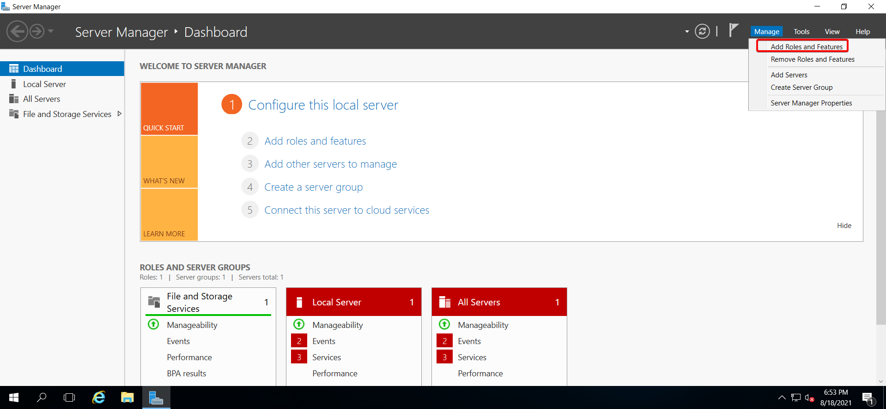

Ya abierto el wizard, daremos click en next 3 veces hasta llegar a la sección de **SERVER SELECTION**, esto lo haremos ya que las opciones que estamos volando la dejaremos por default. Estando en la seccion de Server Roles marcaremos el rol de **ACTIVE DIRECTORY DOMAIN SERVICES**.

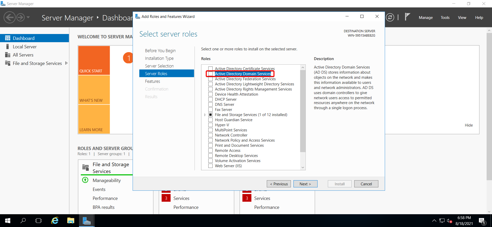

Seleccionado el rol nos aparecerá otra ventana donde daremos click en **ADD FEATURES.**

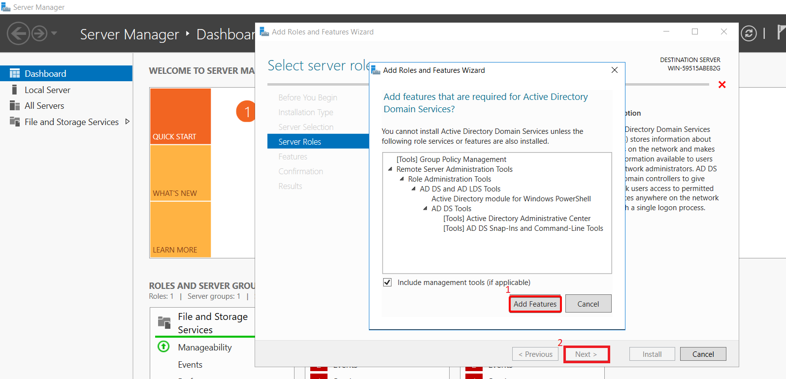

En la sección de **FEATURES** dejamos todo por default y damos click en next.

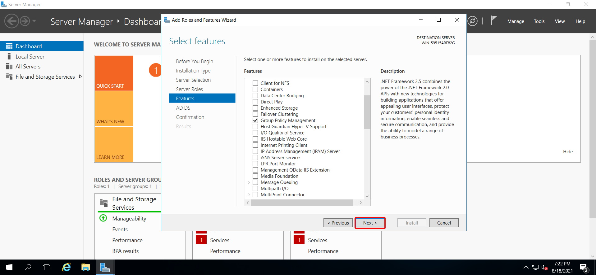

Ya estando en la sección de **CONFIRMATION** marcamos la casilla de **RESTART** para que reinicie el equipo en caso de que sea necesario, hecho esto hacemos click en **INSTALL**.

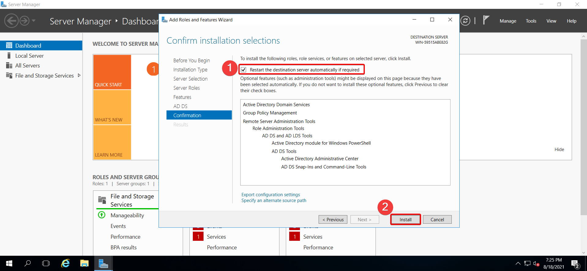

Ahora vamos a esperar que se complete la instalación.

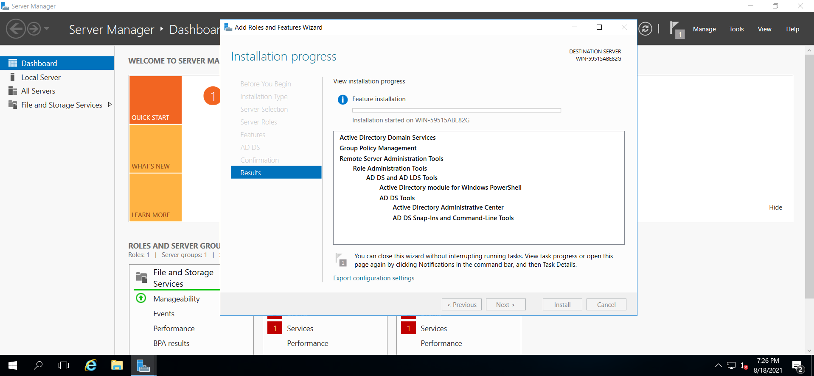

Terminada la instalación vamos a dar click en **PROMOTE THIS SERVER TO A DOMAIN CONTROLLER**

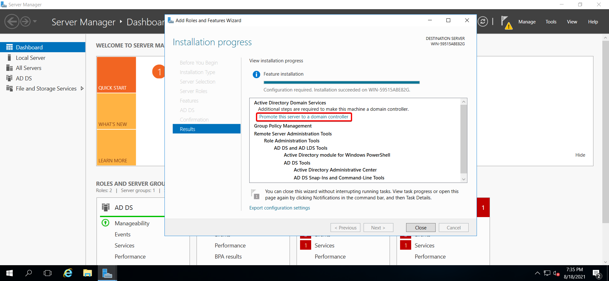

Hecho click en la opción anterior se nos abrirá una venta para promover nuestro servidor como controlador de dominio, como no tenemos ningún forest configurado seleccionaremos la opcion **ADD A NEW FOREST**, y en la seccion **ROOT DOMAIN NAME** escribiremos el nombre de dominio que queremos tener.

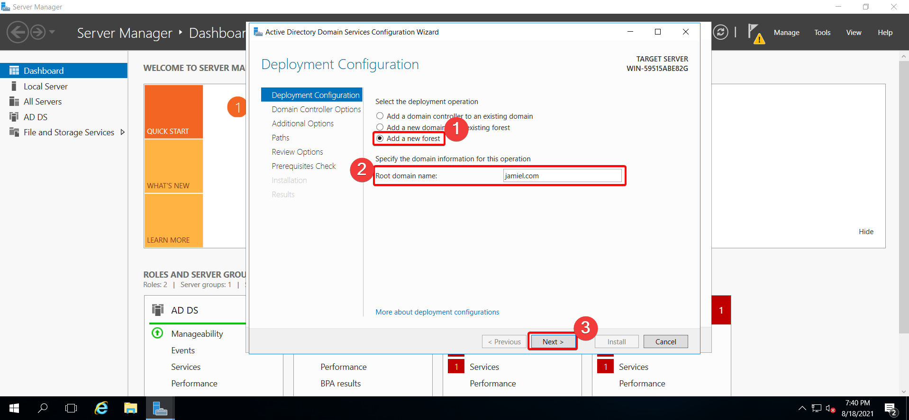

En el siguiente paso vamos a indicar la password para el modo de restauración.

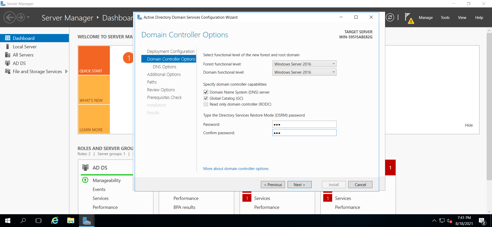

En la parte de DNS OPTIONS la dejaremos por default.

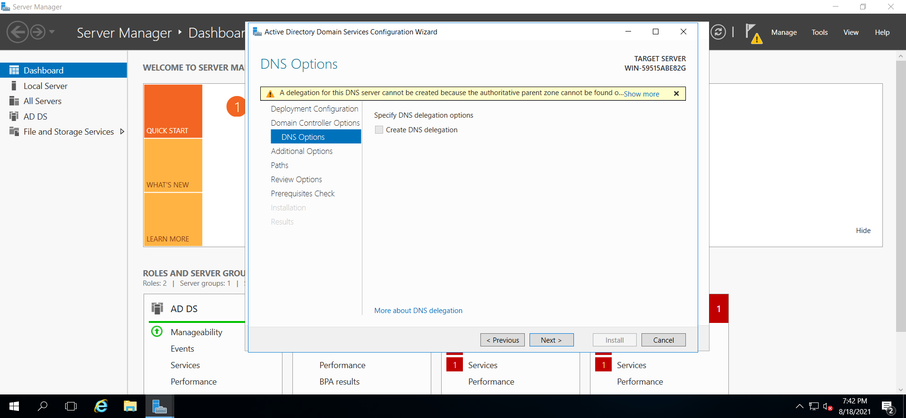

Ya en **ADDITIONAL OPTIONS** lo dejaremos por default igualmente y daremos click en next.

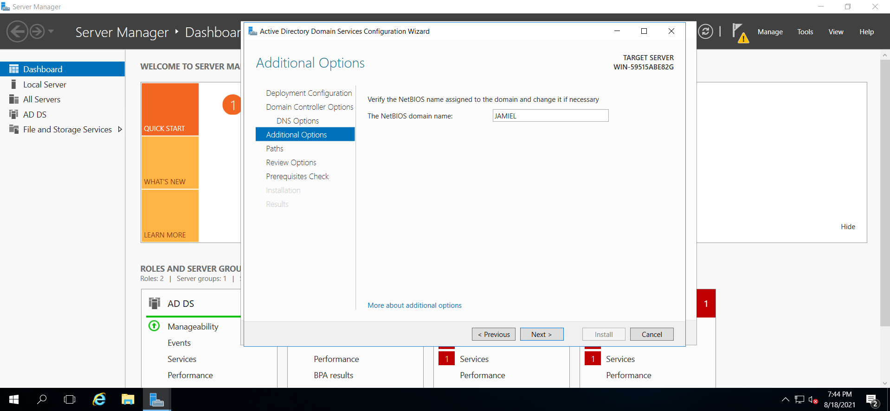

Las demás opciones la dejaremos por default, por lo tanto daremos click en next hasta llegar a la sección de Prerequisites check. Si tenemos todo bien podemos dar click en **Install.**

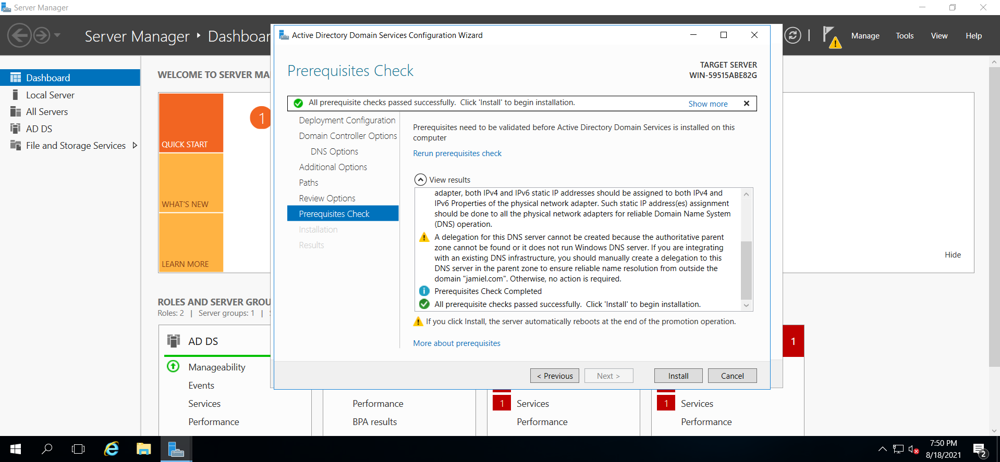

Terminada la intalación nuestro servidor procederá a reiniciarse por lo tanto esperamos a que se complete este proceso y veremos que nuestro AD se ha instalado correctamente.

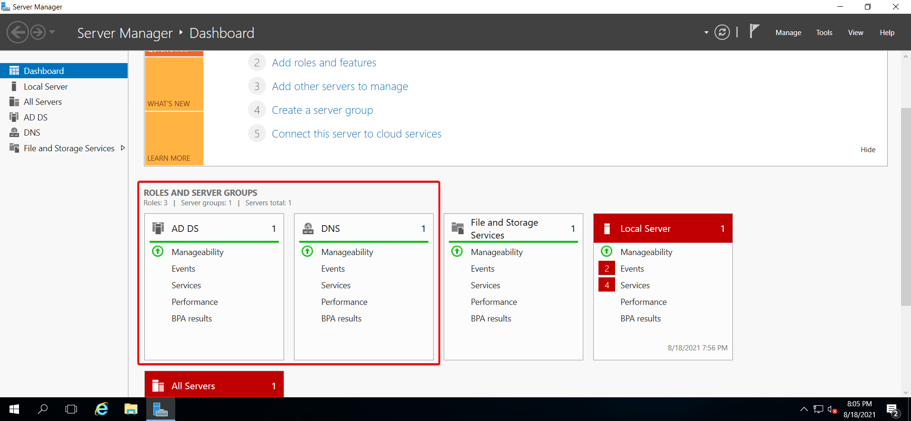

