# **Habilitar Active Directory Certificate Authority**

Como primer paso vamos a  ejecutar powershell como administrador, y verificaremos si el rol y sus componentes están disponibles para la instalación y si están instalados.

```powershell
Get-WindowsFeature | where {$_.name -like "adcs*" -or $_.name -like "ad-c*"}
```

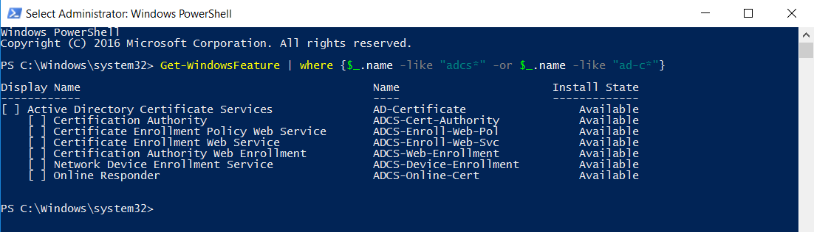

En mi caso no tengo el rol instalado, por lo tanto vamos a instalar el servicio con el siguiente comando:

```powershell
Install-WindowsFeature adcs-cert-authority –IncludeManagementTools 
```

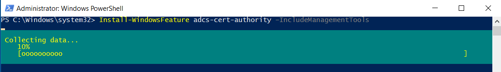

Terminado este proceso nos vamos a dirigir a nuestro **SERVER MANAGER** veremos la sección de notificaciones   con un warning, si damos click en él veremos que tiene que ver con nuestro AD AC, daremos click en **CONFIGURE ACTIVE DIRECTORY CERTIFICATE SERVICES **

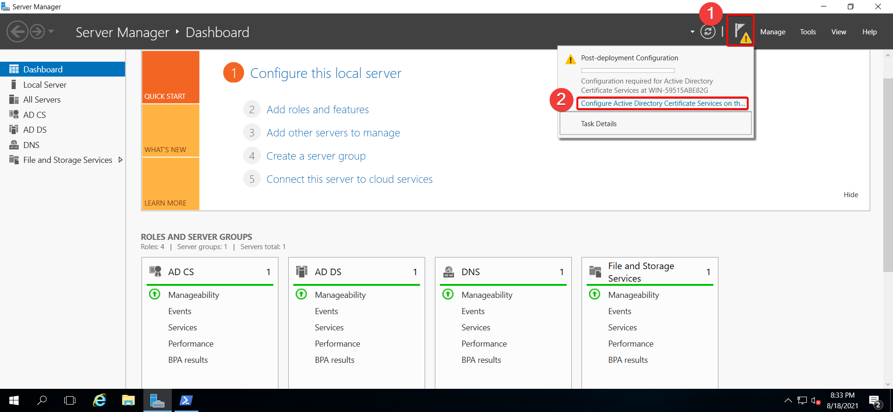

Abierta la ventana de configuración, esperamos que cargue y cuando se encuentre lista daremos click en next.

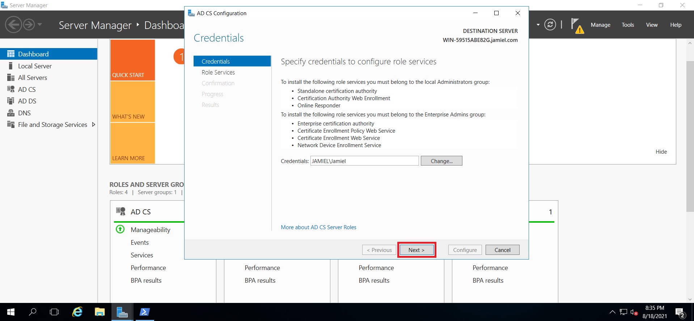

Ahora vamos a seleccionar el roles que queremos instalar de este servicio. 

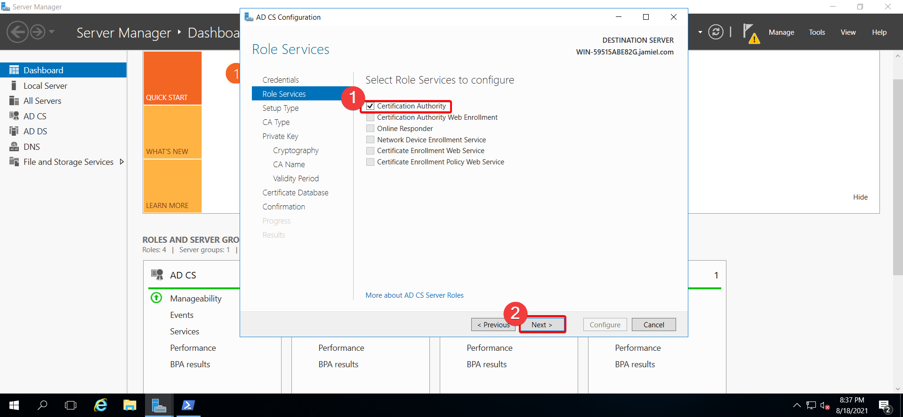

Como siguiente paso el tipo de setup nuestra será Standalone CA, dabido a que solo es con motivos prácticos y de estudios.

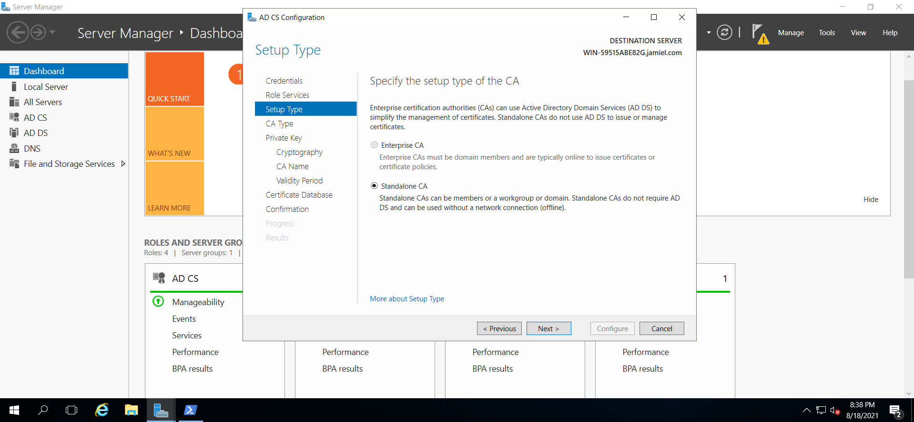

El tipo de CA lo pondremos como **ROOT CA**

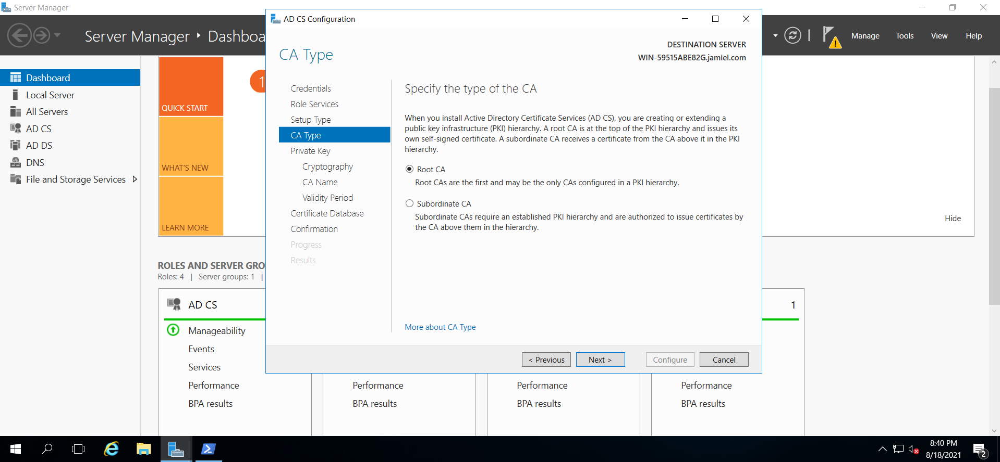

Pasaremos a generar nuestra clave privada, ya que no tenemos ninguna dejamos seleccionada la primera opción para crear una nueva. seleccionada la opción damos click en next.

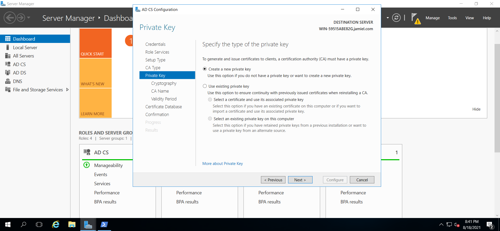

Vamos a configurar la criptografía de la clave, vamos a dejar todo por defecto en este caso, dejando claro que estos son los parámetros de seguridad mínimos recomendados para las claves de cifrado.

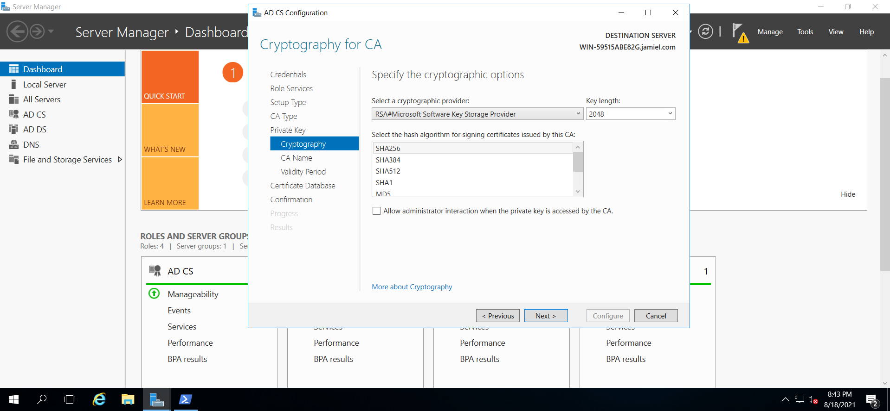

Ya en el siguiente paso tendremos que especificar el nombre del CA, windows server nos proporciona esta info automáticamente así que no tendremos que pasar ningún parámetro y dejamos todo como está.

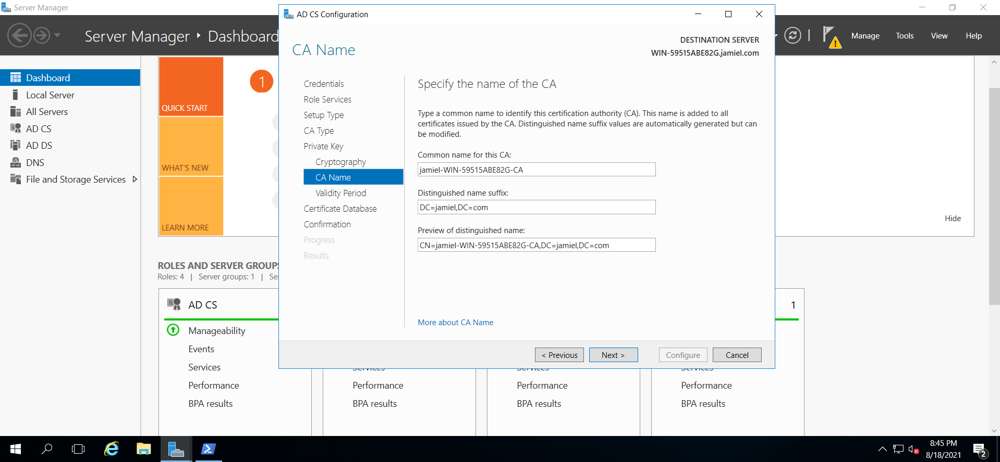

Hecho click en next, en el siguiente paso tendremos que especificar el tiempo de expiración del certificado, en nuestro caso lo dejaremos por default que son 5 años.

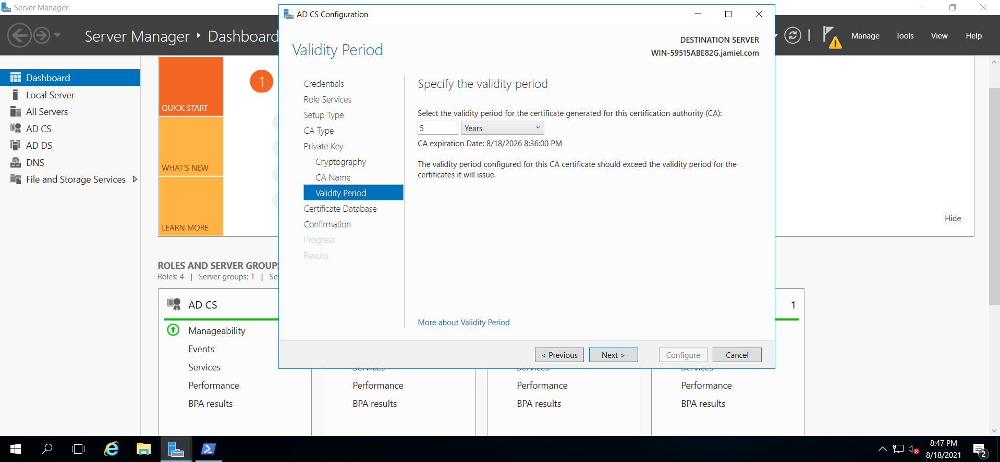

Ya como último paso verificamos que los datos son los que deseamos, si es así damos click en configure.

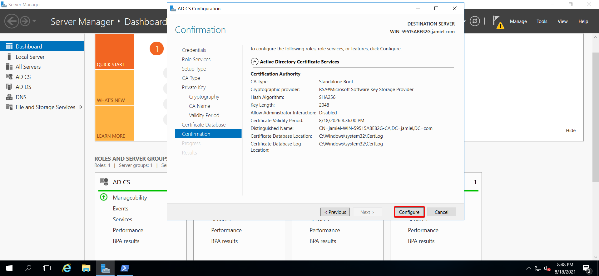

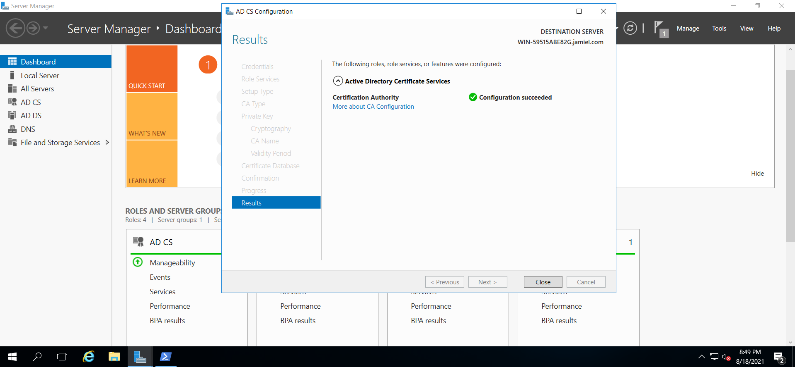

!!! info
	En esta sección se cumplió con: **Generar un certificado utilizando ADCA.**

