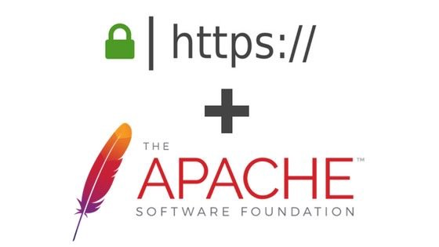

# **Proyecto Final – Fundamentos de Seguridad**

---------------------------------------

1. Implementar un dominio en Active Directory. 
2. Habilitar Active Directory Certificate Authority. 
3. Instalar un servidor web en Linux utilizando Apache. 
4. Añadir este servidor Linux a Active Directory. 
5. Generar un certificado utilizando ADCA. 
6. Instalar dicho certificado en su servidor Web y habilitar tráfico mediante HTTPS. 
7. Debe redireccionar el tráfico HTTP a HTTPS. 
8. Utilizar Nessus para escanear las vulnerabilidades de su servidor. 
9. Aplicar las soluciones recomendadas por Nessus para resolver todas las  vulnerabilidades médium, high y critical.

# **Objetivo** 

En esta práctica tiene como objetivo aprender los conocimientos básicos, de como configurar un certificado SSL por medio de la característica de windows server (**Active Directory Certificate Authority**), muchas personas  sabrán hacerlo mediante **lets encrypt**, pero en este caso aprenderemos algo totalmente diferente pero con el mismo resultado.

# **Definiciones**

**Dominio:** El dominio es la unidad básica encargada de agrupar y de permitir la  eficiente gestión de usuarios, recursos compartidos permisos. Un controlador de dominio almacena los datos referentes a este,  usuarios, recursos etc y de controlar lo forma en a que estos pueden  interactuar entre si, principalmente mediante permisos.

**Active Directory Certificate Authority: **Permite emitir y gestionar  certificados digitales utilizados en sistemas de seguridad que emplean  tecnologías de clave pública. Los certificados digitales que **AD** CS proporciona se pueden utilizar para cifrar y firmar digitalmente documentos y mensajes electrónicos.

**Active Directory:** Active Directory o Directorio Activo son los términos que utiliza  Microsoft para referirse a su implementación de servicio de directorio  en una red distribuida de computadoras. Utiliza distintos protocolos,  principalmente LDAP, DNS, DHCP y Kerberos

**Servidor web:** Un servidor web o servidor HTTP es un programa informático que  procesa una aplicación del lado del servidor, realizando conexiones  bidireccionales o unidireccionales y síncronas o asíncronas con el  cliente y generando o cediendo una respuesta en cualquier lenguaje o  aplicación del lado del cliente.

**Servidor HTTP Apache:** El servidor HTTP Apache es un servidor web HTTP de código abierto, para plataformas Unix, Microsoft Windows, Macintosh y otras, que  implementa el protocolo HTTP/1.1 y la noción de sitio virtual según la  normativa RFC 2616.

**Certificado web:** Es un pequeño archivo de  datos que vincula digitalmente una clave criptográfica con los datos de  una organización. Una vez instalado en el servidor web, el **certificado** activa el candado y el protocolo https y, de esta forma, se habilita  una conexión segura desde el servidor web hasta el navegador.

**HTTP:** Es un protocolo de la capa de  aplicación para la transmisión de documentos hipermedia, como HTML. Se trata de un protocolo sin estado, lo que significa que el servidor no guarda ningún dato (estado) entre dos peticiones.

**HTTPS:** El Protocolo seguro de transferencia de hipertexto es un protocolo de aplicación basado en el protocolo HTTP, destinado a la transferencia segura de datos de hipertexto, es decir, es la versión segura de HTTP.

**NESSUS:** Nessus es un programa de escaneo de vulnerabilidades en diversos  sistemas operativos. Consiste en un demonio o diablo, nessusd, que  realiza el escaneo en el sistema objetivo, y nessus, el cliente que  muestra el avance e informa sobre el estado de los escaneos.

