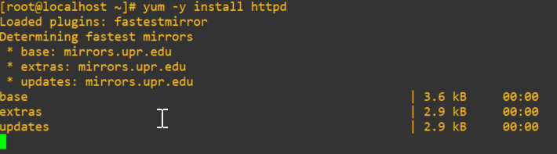
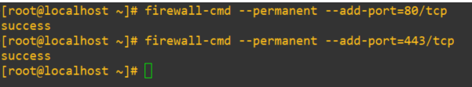
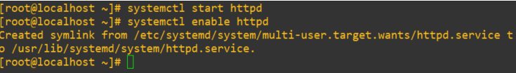
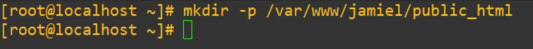
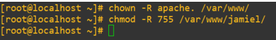
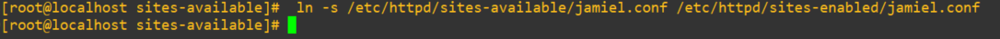
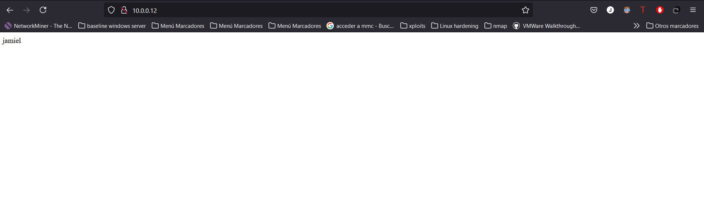

# **Instalar un servidor web en Linux utilizando Apache**

----------------------

## **Instalación**

Procedemos a instalar nuestro servicio **httpd** que corresponde al servicio de Apache, cabe destacar que la instalación se realizará en **CENTOS 7**, para instalar el servicio ejecutamos el siguiente comando:

```bash
yum -y install httpd 
```



Como esto no es un serv en producción vamos a deshabilitar **selinux** en este caso, este proceso no es recomendable realizarlo en entornos reales, los comando que utilizaremos son los siguientes.

```bash
setenforce 0
sed -i 's/enforcing/disabled/' /etc/sysconfig/selinux
sed -i 's/enforcing/disabled/' /etc/selinux/config
```

Ahora vamos abrir los puertos en nuestro en firewall, en nuestro caso como es un servidor web abriremos los puertos 80, 443, haremos uso del siguiente comando.

```bash
firewall-cmd --permanent --add-port=80/tcp
firewall-cmd --permanent --add-port=443/tcp
firewall-cmd --reload
```



El siguiente paso seria configurar apache para que inicie con el sistema, para esto tenemos que iniciar el servicio y luego pasar el parametro de enable.

```bash
systemctl start httpd
systemctl enable httpd
```



## **Creación de directorios**

Ya que tendremos una configuración basada en VirtualHost, debemos crear el directorio el cual será manejado por el VirtualHost.

```bash
mkdir -p /var/www/nombre_de_tu_directorio # EJEMPLO mkdir -p /var/www/jamiel/public_html
```



Ahora ya que tenemos el fichero creado tendremos que asignar el usuario Apache como dueño de dicho directorio, y para lograr esto utilizaremos los siguientes comandos.

```bash
chown -R apache. /var/www/
chmod -R 755 /var/www/tu_directorio # EJEMPLO: chmod -R 755 /var/www/jamiel/
```



Ahora vamos a configurar los directorios que manejaran los VirtualHost.

```bash
mkdir /etc/httpd/sites-available
mkdir /etc/httpd/sites-enabled
```

## **Configurar .conf del VirtualHost**

Accederemos al directorio sites-available y crearemos un archivo .conf, con el nombre preferiblemente del directorio que contiene todo lo referente a la web.

```bash
cd /etc/httpd/sites-available/
nano {nombre_de_tu_gusto.conf} # EJEMPLO: nano jamiel.conf
# Dentro del archivo lo siguiente
<VirtualHost *:80>
ServerName {IP O DOMINIO}
DocumentRoot /var/www/{nombre de tu dir} # EJEMPLO: DocumentRoot /var/www/jamiel/public_html
ErrorLog /var/www/{tu dir}/error.log 	# EJEMPLO: ErrorLog /var/www/jamiel/error.log 
CustomLog /var/www/{tu dir}/access.log combined
</Virtualhost>
```

Creado todo esto crearemos un enlace simbólico hacia el sites-enable, esto lo haremos aplicando el siguiente comando.

```bash
 ln -s /etc/httpd/sites-available/{tu file}.conf /etc/httpd/sites-enabled/{tu file}.conf
```



Como último paso de esta conf solo nos queda reiniciar el servicio http.

```bash
systemctl restart httpd.service
```

Accedemos a la web y vemos que si hemos realizado los pasos correctamente todo funciona a la perfección.



