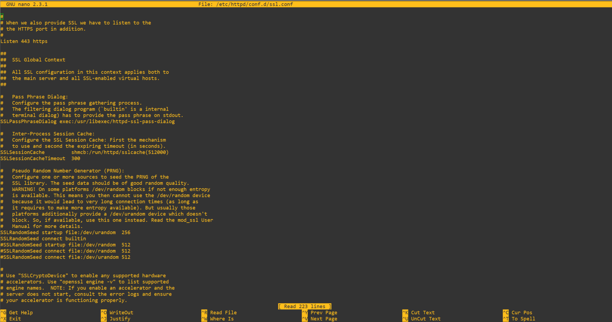
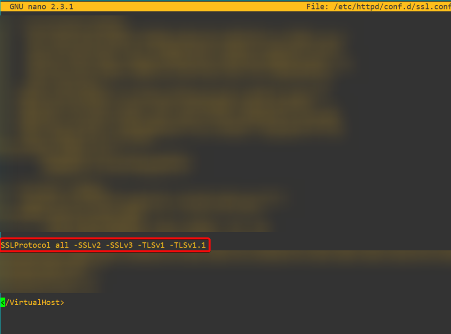
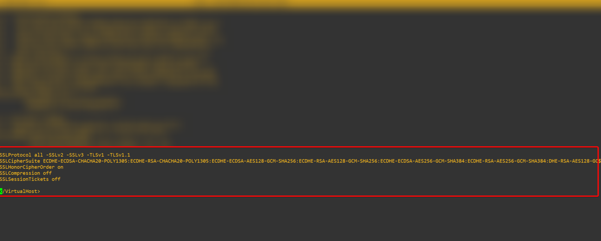

# **Utilizar Nessus para escanear las vulnerabilidades de su servidor**

------------------

Ya teniendo listo nuestro **Nessus** le haremos un SCAN a nuestro servidor web para ver que resultados nos da sobre nuestro servidor y así de esta marena buscarle una solución a los errores mostrados. En el caso de este proyecto estaremos resolviendo solo los problemas (medium, hight y critical). 

En mi caso en el informe tuve hallazgos medios y hight, los cuales fueron los siguientes. [Click aquí para ver el informe](html/scan1.html)

Ahora vamos a presentar la solución a cada uno de los problemas.

## **TLS Version 1.0 Protocol Detection**

Este es un problema que se da mucho en los servidores web que no tienen un buen hardening implementado, y es causado debido a que el servicio remoto acepta conexiones cifradas mediante TLS 1.0. TLS 1.0 tiene una serie de defectos de diseño criptográfico. Las implementaciones modernas de TLS 1.0 mitigan estos problemas, pero las versiones más recientes de TLS, como la 1.2 y la 1.3, están diseñadas contra estos fallos y deberían utilizarse siempre que sea posible.

### **Solución**

Simplemente tendremos que dirigirnos a nuestro archivo **ssl.conf** que en mi caso y seguramente en el de ustedes este archivo se encuentre en la ruta **/etc/httpd/conf.d/ssl.conf** abrimos este archivo en mi caso con nano

```bash
nano /etc/httpd/conf.d/ssl.conf
```



Aquí vamos poner lo siguiente.

```bash
SSLProtocol all -SSLv2 -SSLv3 -TLSv1 -TLSv1.1
```

Esto desactivará las versiones inseguras de TLS en la web, a mi me quedó de la siguiente manera.

**Hay que tener en cuenta que la última linea de este file es </virtualhost> y por lo tanto todos los parámetros que vayamos a agregar deben ir antes de esta línea.**



## **SSL Certificate Cannot Be Trusted and SSL Self-Signed Certificate**

Estos problemas simplemente los vamos a obviar debido que surgen por que tenemos un certificado autofirmadoo, y al no venir de una entidad de confianza nos detecta el certificado firmado por una entidad no autorizada.

### **Solución**

La simple y llana solución a este problema, es adquirir un certificado de una entidad verdaderamente certificadora.

## **SSL Medium Strength Cipher Suites Supported (SWEET32)**

Esta fue la problemática más alta con la que me encontré la cual es nivel Hight, pero su solución es muy simple. Este problema surge debido a que el host remoto admite el uso de cifrados SSL que ofrecen un cifrado de fuerza media. Nessus considera que un cifrado de fuerza media es cualquier cifrado que utilice longitudes de clave de al menos 64 bits y menos de 112 bits, o bien que utilice el conjunto de cifrado 3DES.

Esto es fácil de resolver entre comillas debido a que son unos parámetros un poco largos, pero hoy en día todo está en internet :) 

Nos vamos a fijar en el output que nos lanzó Nessus de los cifrados poco seguros que él encontró.

```bash
Medium Strength Ciphers (> 64-bit and < 112-bit key, or 3DES)

    Name                          Code             KEX           Auth     Encryption             MAC
    ----------------------        ----------       ---           ----     ---------------------  ---
    EDH-RSA-DES-CBC3-SHA          0x00, 0x16       DH            RSA      3DES-CBC(168)          SHA1
    ECDHE-RSA-DES-CBC3-SHA        0xC0, 0x12       ECDH          RSA      3DES-CBC(168)          SHA1
    DES-CBC3-SHA                  0x00, 0x0A       RSA           RSA      3DES-CBC(168)          SHA1

The fields above are :

  {Tenable ciphername}
  {Cipher ID code}
  Kex={key exchange}
  Auth={authentication}
  Encrypt={symmetric encryption method}
  MAC={message authentication code}
  {export flag}
```

Visto los cifrados poco seguros que nos recomienda Nessus no admitir en nuestra web, haremos lo siguiente. Vamos a nuestro archivo **ssl.conf ** que mencionamos anteriormente, y agregamos la siguiente línea

```bash
SSLCipherSuite ECDHE-ECDSA-CHACHA20-POLY1305:ECDHE-RSA-CHACHA20-POLY1305:ECDHE-ECDSA-AES128-GCM-SHA256:ECDHE-RSA-AES128-GCM-SHA256:ECDHE-ECDSA-AES256-GCM-SHA384:ECDHE-RSA-AES256-GCM-SHA384:DHE-RSA-AES128-GC$
SSLHonorCipherOrder on
SSLCompression off
SSLSessionTickets off
```

Estos pámetros nos ayudarán a deshabilitar los cifrados no seguros que se vieron en el output de Nessus, Lo que hicimos aquí fue permitir todos los otros que Nessus no considera inseguros sin incluir lo que Nessus nos indicó.

Nuestro archivo **ssl.conf** quedará en las última líneas de la siguiente manera.



Hecho todo esto podemos decir que tenemos todo resuelto sobre los problemas que encontramos, por lo tanto solo nos queda reiniciar el servicio httpd que corresponde a apache, esto lo haremos con el comando. 

```bash
systemctl restart httpd
```

y si no hemos recibido ningún output durante la ejecución del comando significa que todo está bien, de todas formas accedan a la web para confirmar que todo está bien.

Si todo está correcto vuelven a realizar el mismo scan a su servidor web y veremos los resultados, los mios fueron los siguientes. [Click aquí para ver mi reporte](html/scan2.html)

Si ven mi reporte podemos notar que todo se ha solucionado a la perfección mejor la problemática del certificado que debe ser proveniente de una entidad autorizada.

