# **Instalar dicho certificado en su servidor Web y habilitar tráfico mediante HTTPS**

Vamos primeramente a exportar el certificado al formato PFX desde windows server.

Abriremos nuestro **mmc.exe** procederemos a seguir los pasos de las imagenes mostradas.

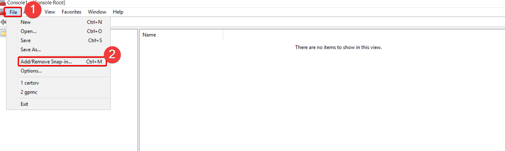

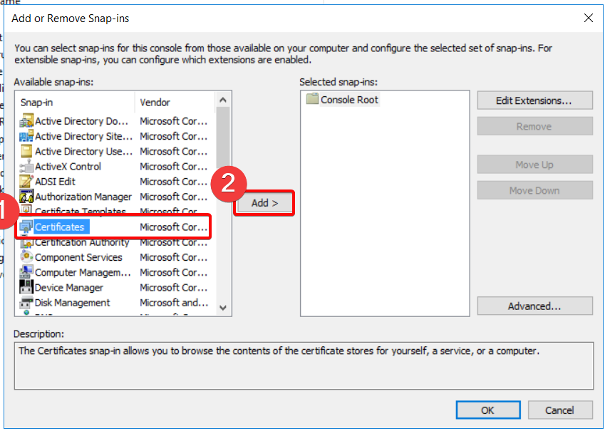

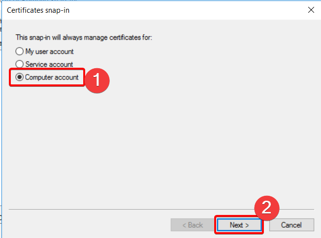

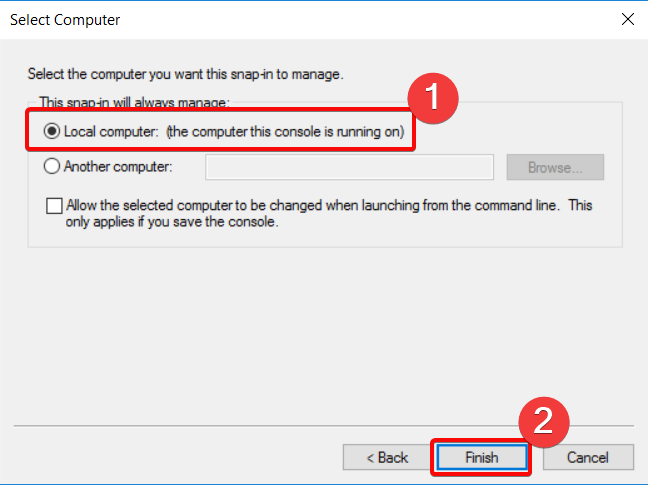

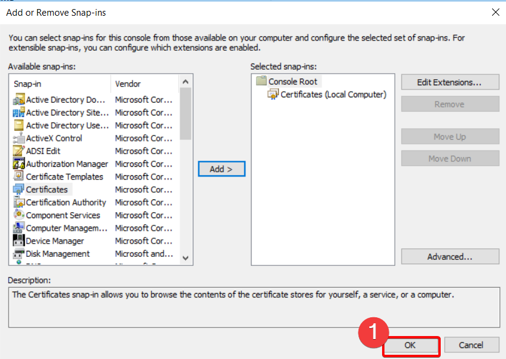

Ya teniendo los resultados  de los certificados, accederemos a los certificados personales que hemos generado.

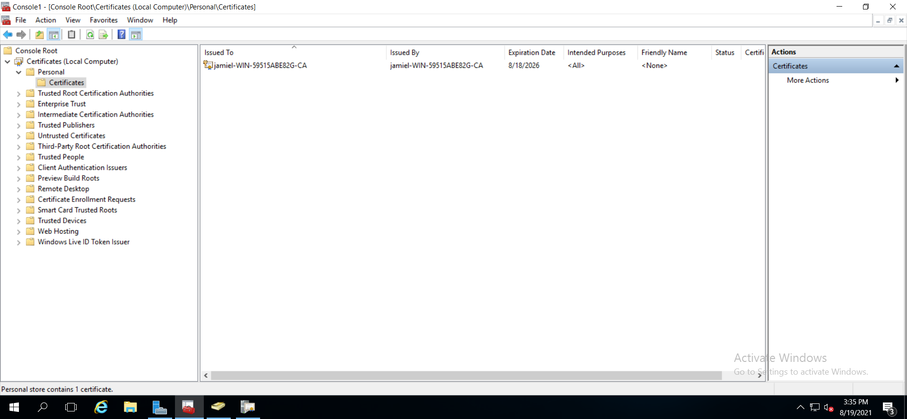

Ya estando en el path del certificado, daremos **click derecho en la cert > All Task > Export**

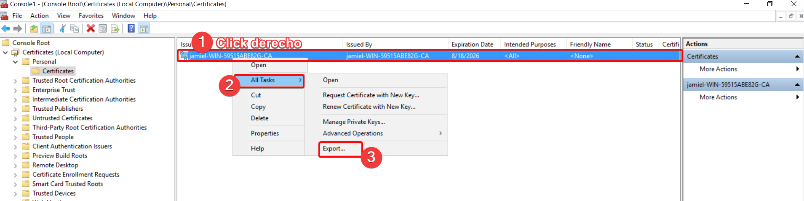

Hecho esto se nos abrirá el wizarrd para exportar los certificados,  rápidamente daremos click en next.

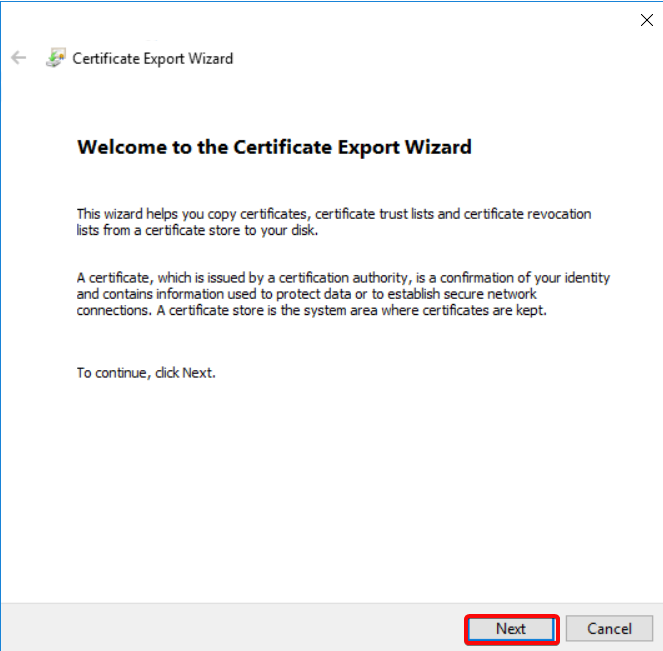

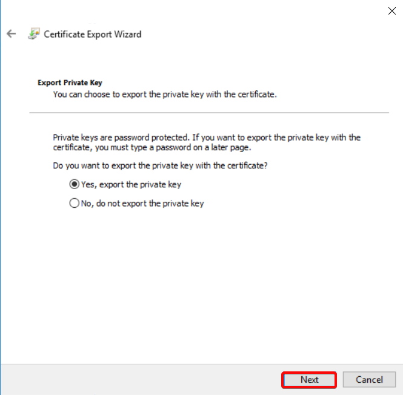

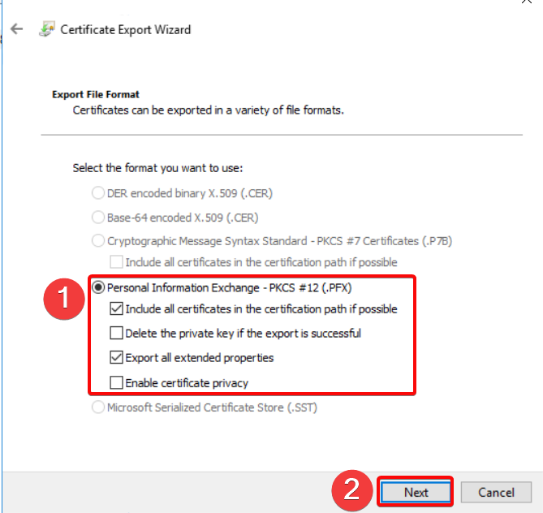

En esta sección tendremos que tener pendiente, la password que asignemos ya que es la que utilizaremos más adelante con openssl.

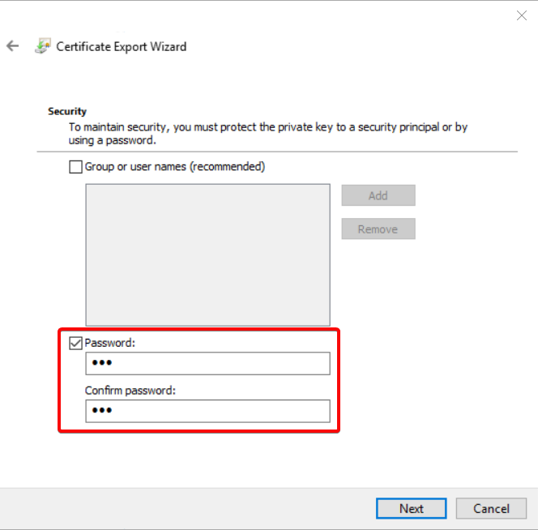

Ahora como último paso vamos a seleccionar el fichero donde queremos que se guarde el archivo.

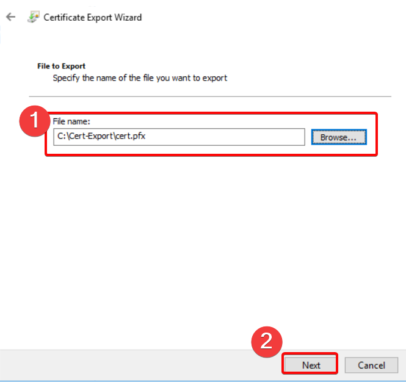

Nos muestra los settings que hemos configurado para la exportación, si vemos que todo se encuentra bien damos click en **Finish.**

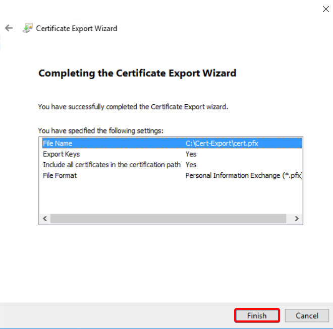

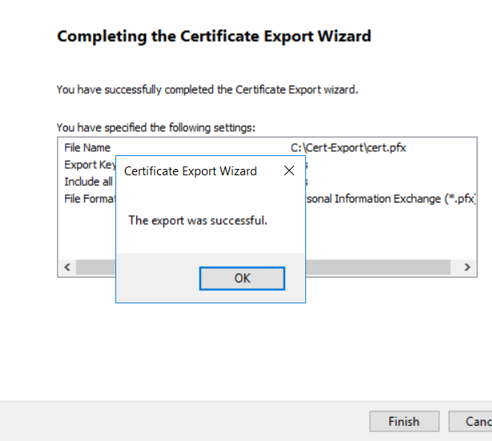

## **Pasar la cert a Linux Apache**

Ahora vamos a buscar la manera de pasar el certificado a nuestro servidor web linux, para luego proceder con la instalación del Certificado en nuestro serv web.

El método que hemos utilizado es crear una carpeta compartida que nos permita obtenter el certificado en nuestro server web. 

En nuestro server manager daremos doble click en **File an Storage Services**, entrando en esta sección hacemos click en **shares**, estando en shares daremos click derecho, y luego daremos click en **New share**, haremos el setup que es muy fácil de hacer.

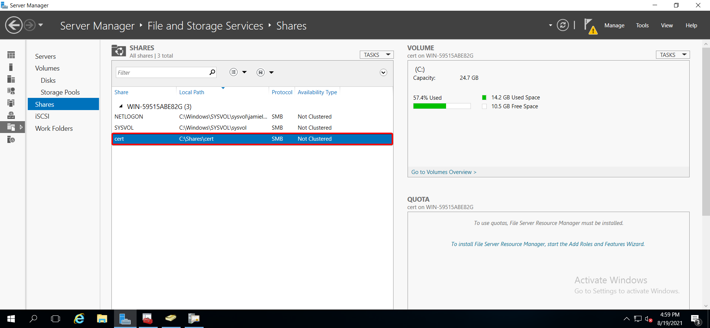

Creado la carpeta compartida, vamos a pasar la cert que creamos anteriormente y lo ponemos en nuestra carperta compartida.

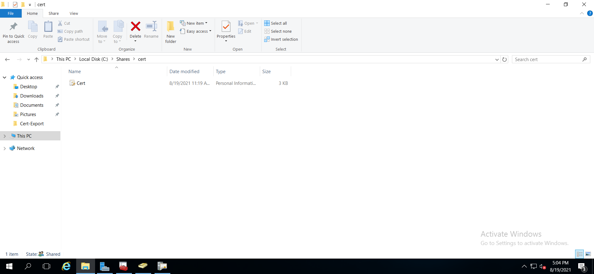

### **Conectar linux a carpeta compartida**

En nuestro caso estamos usando Centos 7 como servidor web, para poder acceder a la carpeta compartida tendremos que descargar un paquete llamado **smbclient**, esto lo haremos con el siguiente comando.

```bash
yum install smbclient -y
```

Ya instalado este paquete nos podemos conectar a la carpeta de la siguiente manera.

```bash
smbclient -U {user} {PATH}  # smbclient -U Administrator //10.0.0.90/cert
```

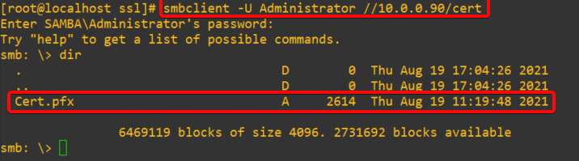

Ya confirmamos que podemos acceder ahora salimos de ese modo y vamos a copiar el certificado directamente a nuestro linux.

```bash
smbget -R -U {USER} smb:{PATH}
# EJEMPLO
# smbget -R -U administrator smb://10.0.0.90/cert/
```

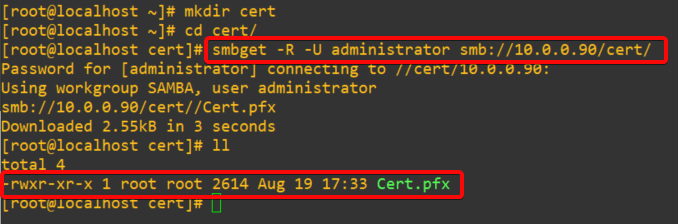

## **Generar clacves SSL** 

Obtenido el file **pfx**, vamos a proceder a genernar los archivos necesearios para que nuestra web corra correctamente por medio de https. 

1.Exportar la llave privada del fichero pfx.

```bash
openssl pkcs12 -in fichero_exportado_de_iis.pfx -nocerts -out ca.pem
```

2.Exportar el certificado del fichero pfx

```bash
openssl pkcs12 -in fichero_exportado_de_iis.pfx -clcerts -nokeys -out cert.pem
```

3.Eliminar la clave que se adjunta a la clave privada, para que Apache no pregunte por la misma cuando arranca.

```bash
openssl rsa -in ca.pem -out private.key
```

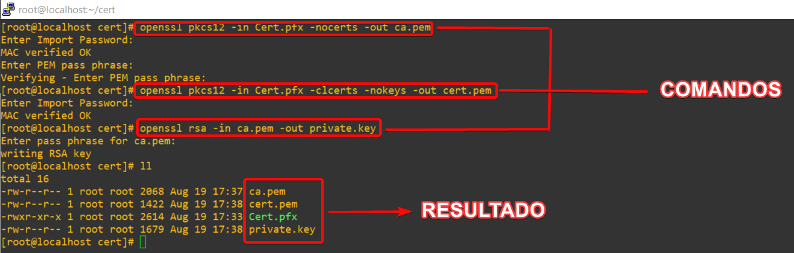

Obtenido estos archivos ahora nos toca agregarlos a nuestro virtualhost de la siguiente manera, incluido a esto pondremos una redirección obligatoria de **HTTP --> HTTPS.**

````bash
<VirtualHost *:80>
        ServerName 10.0.0.50 # aquí pueden poner su FQDN o la ip de su serv web
        ErrorLog /var/www/jamiel/error.log
        CustomLog /var/www/jamiel/access.log combined 
        Redirect permanent / https://10.0.0.50/ # Esta linea es la que forza la redirección
</Virtualhost>

<VirtualHost _default_:443>
    SSLEngine On
    DocumentRoot /var/www/jamiel/public_html
    ServerName 10.0.0.50
    # RUTA DE LOS FILES GENERADOS ANTERIORMENTE 
    SSLCertificateKeyFile /etc/ssl/localcerts/private.key
    SSLCertificateFile /etc/ssl/localcerts/cert.pem
    SSLCertificateChainFile /etc/ssl/localcerts/ca.pem
    # Parámetros adicionales para lograr la conexión https
    SSLVerifyDepth 5
    SSLVerifyClient none
</VirtualHost>
````

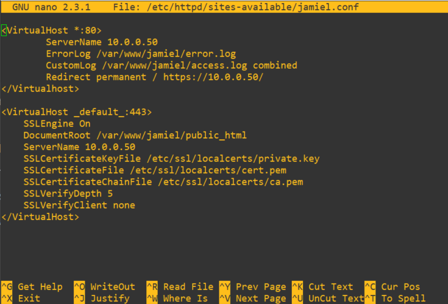

## **Verificando configuración**

En este momento vamos reiniciar el servicio de Apache con el comando.

```bash
systemctl restart httpd
```

Este comando es más que suficiente para reiniciar el servicio, si todo anta bien el comando se debería ejecutar sin ningún output y una vez reiniciado podremos acceder a la web para ver el resultado.

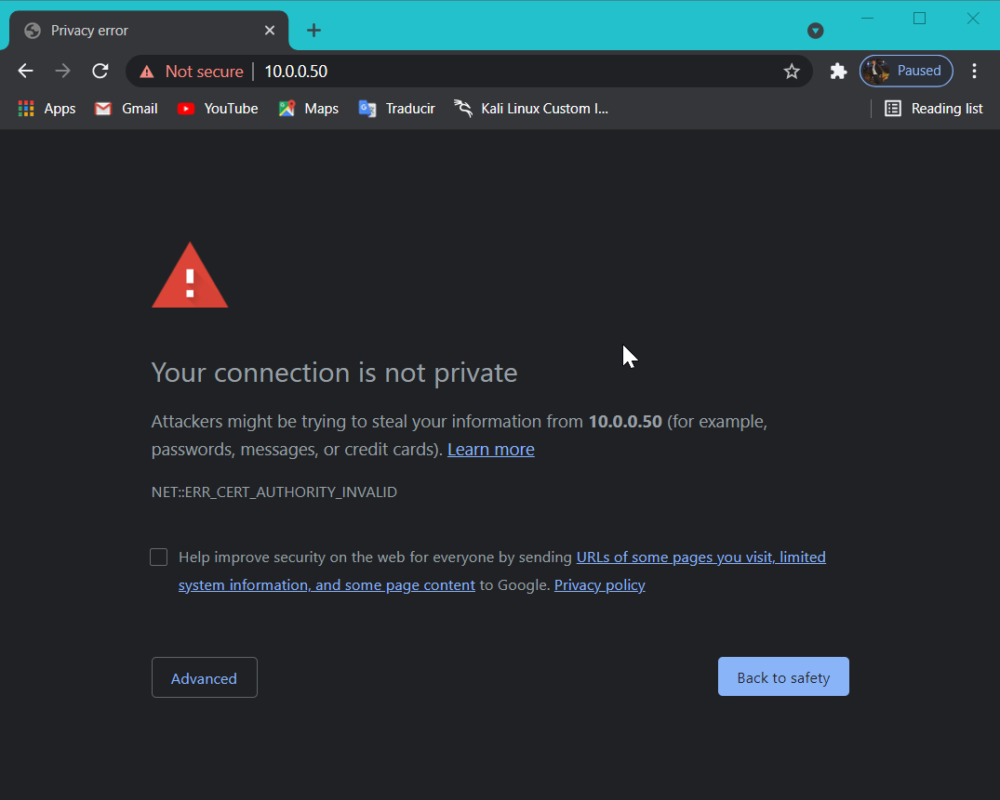

Vemos como con solo tipiar la ip de nuestro servidor nos hace la redirección a HTTPS, sin ningún problema. Nuestra web es vista como no segura debido a que el certificado es autofirmado, pero de igual forma el contenido viaja en https.

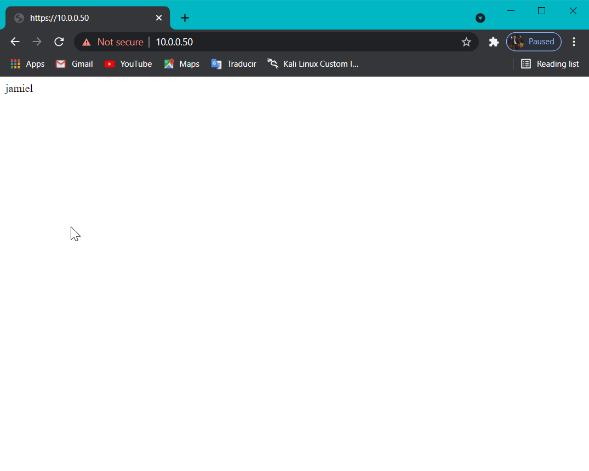

