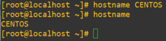
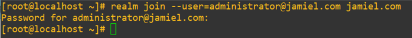
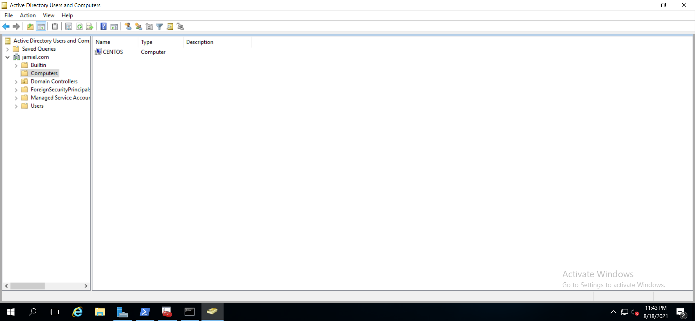

# **Añadir este servidor Linux a Active Directory**

-----------------------------------------------------

## **Instalación y configuración**

Esto es un proceso no muy difícil de realizar.

Primero tendremos que configurarle un hostname al equipo linux, esto lo hacemos con el siguiente comando.

```bash
hostname {nombre deseado} # hostname CENTOS
```



Ahora comenzaremos instalando las siguientes dependencias.

```bash
yum install realmd sssd ntpdate ntp oddjob oddjob-mkhomedir sssd samba-common-tools
```

Ya instaladas las dependencias procedemos a añadir el CENTOS a AD, con los siguientes comandos.

```bash
realm join --user=administrator@{DOMINIO} {DOMINIO}
# EJEMPLO realm join --user=administrator@jamiel.com jamiel.com
```



## **Verificación**

Hecho los pasos anteriores y vemos que nada nos ha lanzado ningún error procedemos a verificar en nuestro AD si el equipo se ha agregado exitosamente. Como vemos en la imagen todo ha salido a la perfección.



