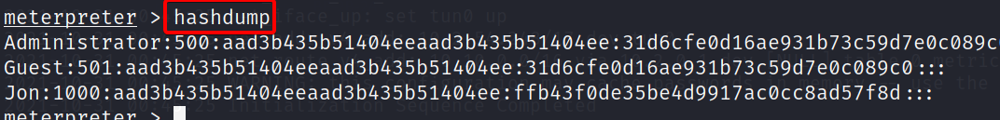
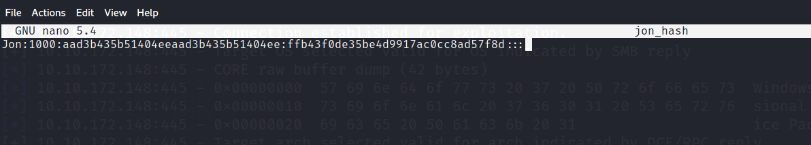
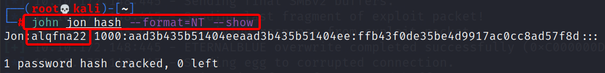

# **What is the name of the non-default user?**

Esto es relativamente sencillo, ya que tenemos la sección meterpreter solo ejecutamos el comando **hashdump**, y obtendremos las password hasheadas de todos los users en el sistema.



Obtenido esto sabemos que el non-default user es **Jon*

**Respuesta:** Jon

# **What is the cracked password?**

Como ya tenemos el hash, lo que haremos es crackearlo con john, esto lo haremos de la siguiente manera.

1. Copiamos la línea completa del user Jon junto con su hash, y lo guardamos en un archivo de nombre cualquiera, en mi caso nombré el archivo como jon_hash.



2. Ahora usaremos la herramienta john con la siguiente sintaxis.

```bash
john jon_hash --format=NT --show
```
!!! GOOD
    **Así obtenemos la password**



**Respuesta**: alqfna22