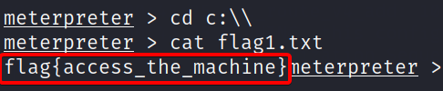
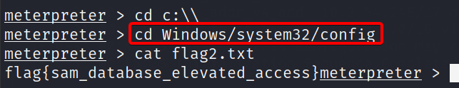
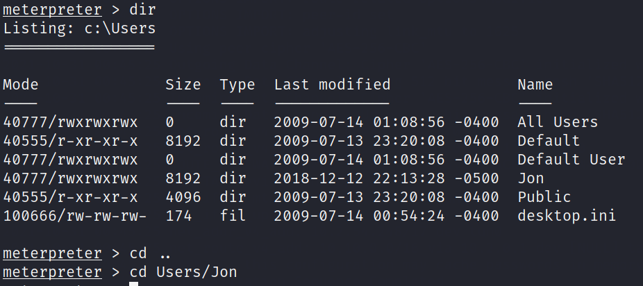
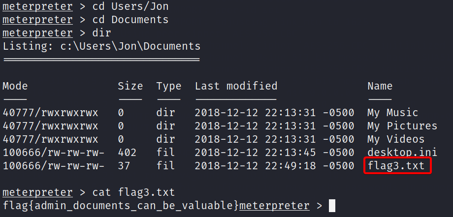

# **Flag1? This flag can be found at the system root.**

Como bien dice THM, se encuentra el en el system root  de windows, por lo tanto en la ruta **C:\\**, para dirigirnos a esa ruta escribimos lo siguiente.

```bash
cd c:\\
```

Estando en el path, pondremos **cat** + flag + {press TAB} + {Press Enter}, esto hará que se nos autocomplete y por lo tanto nos busca el file que estamos buscando, finalmente presionamos enter para el la flag.




# **Flag2? This flag can be found at the location where passwords are stored within Windows**

Esto es fácil la ruta es la siguiente **%SystemRoot%/system32/config/**, si vamos allá encontraremos la flag.



# **Flag3? This flag can be found in an excellent location to loot.**

Lo primero que según las pistas, supongo que está dentro del user jon, así que vamos allá.



Ahora revisaremos dentro de **Documents**, para observar que se encuentra por ahí.

Perfecto la tenemos.

