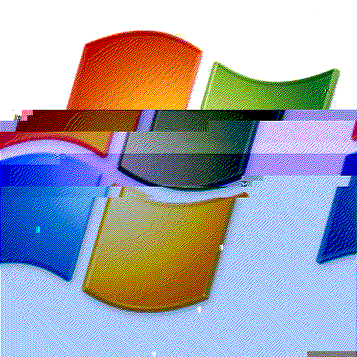

# **BLUE MACHINE TRYHACKME**

**Machine level**: Easy

**OS**: Windows x64

En esta ocasión estaremos explotando la máquina BLUE de THM.

Estaremos viendo como logramos ejecutar satisfactoriamente la vulnerabilidad conocida como Ethernalblue.

# **Qué es Ethernalblue?**
EternalBlue aprovecha una vulnerabilidad en la implementación del protocolo Server Message Block (SMB) de Microsoft. Esta vulnerabilidad, denotada como CVE-2017-01447​8​ en el catálogo Common Vulnerabilities and Exposures (CVE), se debe a que la versión 1 del servidor SMB (SMBv1) acepta en varias versiones de Microsoft Windows paquetes específicos de atacantes remotos, permitiéndoles ejecutar código en el ordenador en cuestión.