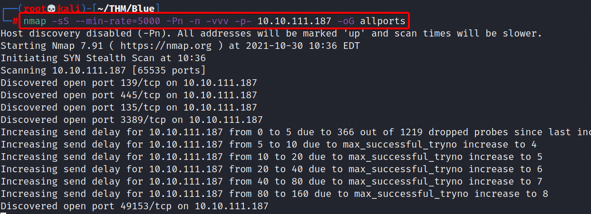
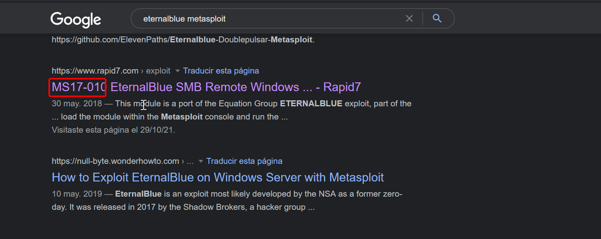

# **Scan the machine**

Para esto usaremos nmap con la siguiente systax

```bash
nmap -sS --min-rate=5000 -Pn -n -vvv -p- 10.10.173.226 -oG allports
```


# **How many ports are open with a port number under 1000?**

Si realizamos el scanning correctamente, veremos que se encuentran 3 puertos abiertos debajo de 1000

- 135/tcp
- 139/tcp
- 445/tcp

# **What is this machine vulnerable to? (Answer in the form of: ms??-???, ex: ms08-067)**

Según el scanning podemos ver que se está utilizando SMBv1, y si lo relacionamos con el nombre de la máquina esto nos huele a Ethernalblue, por lo tanto vamos a buscar la respuesta en el formato correspondiente de la pregunta.

Ahora para encontrar el formato correspondiente a la pregunta me dirigí a google e realicé la siguiente búsqueda.

```bash
eternalblue metasploit
```
 
**De inmediato nos encontramos con esto.**


 
**Respuesta:** MS17-010
