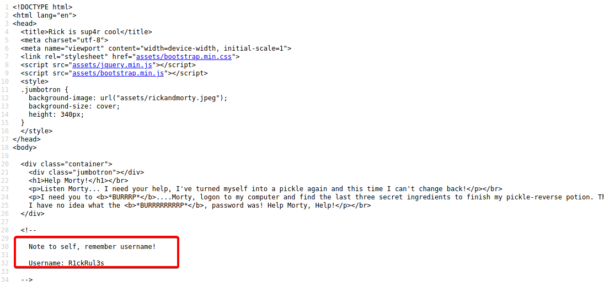
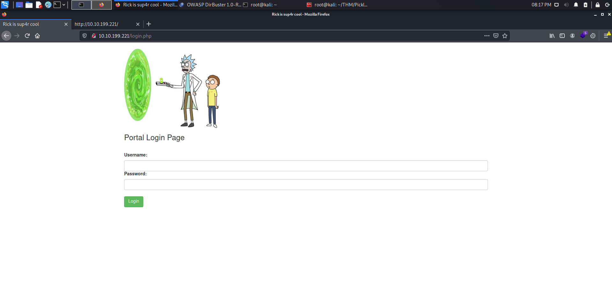

# Pickle Rick

-----------------------------

Primero comenzaremos realizando un scanning a nuestro target en nuestro caso la ip **10.10.199.221**. En este caso usaremos nuestro querido y amado NMAP, para realizar la primera fase de enumeración. 

``` bash
nmap -sS --min-rate=5000 -p- -Pn -n -vvv 10.10.199.221 -oG allports
```
!!! Info
    **-sS** >> Realizamos un Sync port scan, esto hace que el escaneo sea más rápido  debido a el método que utiliza. 

    **--min-rate=5000** >> No emitir paquetes menores de 5000 por segundo.

    **-p-** >> Hacer scanning en todos los puertos **65535**.

    **-Pn** >> Esto es para skipear el host discovery. 

    **-n** >> Para no hacer resolución DNS. 

    **-vvv** >> Indicamos un triple **verbose**, para que nos brinde información.

    **-oG** >> indicamos que el output del scanning se guardará en formato grep-peable en el fichero que especificamos.

Estos fueron los puertos que se encontraron abiertos durante el escaneo: 

```bash
PORT   STATE SERVICE REASON
22/tcp open  ssh     syn-ack ttl 61
80/tcp open  http    syn-ack ttl 61
```

Como vemos que tenemos el puerto **80/tcp** abierto, de lejos nos indica a que puede ser una página web, por lo tanto vamos a comprobar. Y... Efectivamente es una página web, pudimos extraer información de la misma utilizando ciertos plugins dentro del navegador.


La página es la siguiente, y vemos que nos deja algunos **hints** dentro de ella. 




Vemos que hemos conseguido un **User** potencial.

```bash
Username: R1ckRul3s
```

Ahora para seguir haciendo un poco de enumeración manual, accederemos al robots.txt, para verificar que existe, y efectivamente es así, vemos que solo hay unas cuántas letras random, pero la tendremos aquí, deberán servir para algo:

```bash
Wubbalubbadubdub
```

Ahora procederemos a realizar un poco de fuzzing con **dirpbuster**, estos fueron los parámetros que utilizamos:

```bash
dirbuster -l /usr/share/wordlists/rockyou.txt -e html,php -u http://10.10.199.221
```

!!! Info 
    **-l** para indicar el wordlist que usaremos.

    **-e** para indicar las extensiones que usaremos.

    **-u** para indicar nuestro target.

Esperando unos segundos para el resultado nos encontramos con un portal de login que tiene la página, con el nombre de **login.php**, también nos encontramos con un **portal.php**, pero este nos redirige a login.php.




