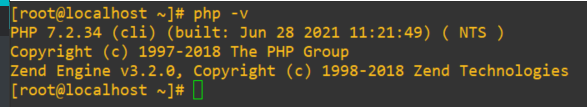

**Nombre del estudiante:** Jamiel Santana.

**Matrícula:** 2019-8095.

**Facilitador:** Geancarlos Sosa.

**Asignatura:** Fundamentos de Seguridad.

# **Primer parcial (el terror) - FreeRADIUS**

---

## Requisitos:

1. CentOS 7.

2. Freeradius.

3. GNS3.

4. Imágenes de disco de router y  switch cisco.

   

## **Setup Initialization**

- Como primer paso comenzaremos actualizando el sistema con el siguiente comando.

  ```bash
  - sudo yum -y update
  ```

  

- Después de actualizado el sistema cambiaremos Selinux a modo permisivo.

  ```bash
  sudo setenforce 0
  sudo sed -i 's/^SELINUX=.*/SELINUX=permissive/g' /etc/selinux/config
  ```

  

## Instalación y configuración de FreeRadius y DolaRadius en centos 7

### Instalando httpd server y las herramientas de desarrollo

- Comenzaremos con la instalación de httpd, y del development tools con los siguientes comandos.

  ```bash
  sudo yum -y groupinstall "Development Tools"
  sudo yum -y install httpd httpd-devel
  ```

  

- Iniciaremos el servicio web

  ```bash
  [jamiel@localhost ~]# sudo systemctl enable --now httpd
  Created symlink from /etc/systemd/system/multi-user.target.wants/httpd.service to /usr/lib/systemd/system/httpd.service.
  [root@localhost ~]# systemctl status httpd
  ● httpd.service - The Apache HTTP Server
     Loaded: loaded (/usr/lib/systemd/system/httpd.service; enabled; vendor preset: disabled)
     Active: active (running) since Thu 2021-07-01 20:39:04 EDT; 11s ago
       Docs: man:httpd(8)
             man:apachectl(8)
   Main PID: 29618 (httpd)
     Status: "Total requests: 0; Current requests/sec: 0; Current traffic:   0 B/sec"
     CGroup: /system.slice/httpd.service
             ├─29618 /usr/sbin/httpd -DFOREGROUND
             ├─29619 /usr/sbin/httpd -DFOREGROUND
             ├─29620 /usr/sbin/httpd -DFOREGROUND
             ├─29621 /usr/sbin/httpd -DFOREGROUND
             ├─29622 /usr/sbin/httpd -DFOREGROUND
             └─29623 /usr/sbin/httpd -DFOREGROUND
  
  Jul 01 20:39:04 localhost.localdomain systemd[1]: Starting The Apache HTTP Server...
  Jul 01 20:39:04 localhost.localdomain httpd[29618]: AH00558: httpd: Could not reliably determine the server's fully qualified domain name, using localhost.localdomain. Set the 'ServerName' di... this message
  Jul 01 20:39:04 localhost.localdomain systemd[1]: Started The Apache HTTP Server.
  Hint: Some lines were ellipsized, use -l to show in full.
  ```

### Instalando y configurando MariaDB

- Lo primero que haremos es agregar el repositorio para poder agregarlo debidamente.

  ```bash
  [jamiel@localhost ~]# sudo tee /etc/yum.repos.d/MariaDB.repo<<EOF
  > [mariadb]
  > name = MariaDB
  > baseurl = http://yum.mariadb.org/10.4/centos7-amd64
  > gpgkey=https://yum.mariadb.org/RPM-GPG-KEY-MariaDB
  > gpgcheck=1
  > EOF
  [mariadb]
  name = MariaDB
  baseurl = http://yum.mariadb.org/10.4/centos7-amd64
  gpgkey=https://yum.mariadb.org/RPM-GPG-KEY-MariaDB
  gpgcheck=1
  [jamiel@localhost ~]#
  ```

- Agregado el repositorio podemos descargar **Mariadb** debidamente.

  ```bash
  sudo yum -y install MariaDB-server MariaDB-client
  ```

  

- Ahora iniciaremos el servicio de Mariadb.

  ```bash
  sudo systemctl start --now mariadb
  ```

- Revisamos el status del servidor.

  ```bash
  [root@localhost ~]# systemctl status mariadb
  ● mariadb.service - MariaDB 10.4.20 database server
     Loaded: loaded (/usr/lib/systemd/system/mariadb.service; disabled; vendor preset: disabled)
    Drop-In: /etc/systemd/system/mariadb.service.d
             └─migrated-from-my.cnf-settings.conf
     Active: active (running) since Thu 2021-07-01 20:48:24 EDT; 57s ago
       Docs: man:mysqld(8)
             https://mariadb.com/kb/en/library/systemd/
    Process: 29945 ExecStartPost=/bin/sh -c systemctl unset-environment _WSREP_START_POSITION (code=exited, status=0/SUCCESS)
    Process: 29902 ExecStartPre=/bin/sh -c [ ! -e /usr/bin/galera_recovery ] && VAR= ||   VAR=`cd /usr/bin/..; /usr/bin/galera_recovery`; [ $? -eq 0 ]   && systemctl set-environment _WSREP_START_POSITION=$VAR || exit 1 (code=exited, status=0/SUCCESS)
    Process: 29900 ExecStartPre=/bin/sh -c systemctl unset-environment _WSREP_START_POSITION (code=exited, status=0/SUCCESS)
   Main PID: 29913 (mysqld)
     Status: "Taking your SQL requests now..."
     CGroup: /system.slice/mariadb.service
             └─29913 /usr/sbin/mysqld
  ```

- Como próximo paso ahora ejecutaremos el **mysql_secure_installation** para configurar la base de datos.

  ```bash
  [root@localhost ~]# mysql_secure_installation
  
  NOTE: RUNNING ALL PARTS OF THIS SCRIPT IS RECOMMENDED FOR ALL MariaDB
        SERVERS IN PRODUCTION USE!  PLEASE READ EACH STEP CAREFULLY!
  
  In order to log into MariaDB to secure it, we'll need the current
  password for the root user. If you've just installed MariaDB, and
  haven't set the root password yet, you should just press enter here.
  
  Enter current password for root (enter for none):
  OK, successfully used password, moving on...
  
  Setting the root password or using the unix_socket ensures that nobody
  can log into the MariaDB root user without the proper authorisation.
  
  You already have your root account protected, so you can safely answer 'n'.
  
  Switch to unix_socket authentication [Y/n] y
  Enabled successfully!
  Reloading privilege tables..
   ... Success!
  
  You already have your root account protected, so you can safely answer 'n'.
  
  Change the root password? [Y/n] Y^C
  Aborting!
  
  Cleaning up...
  [root@localhost ~]# clear
  [root@localhost ~]# mysql_secure_installation
  
  NOTE: RUNNING ALL PARTS OF THIS SCRIPT IS RECOMMENDED FOR ALL MariaDB
        SERVERS IN PRODUCTION USE!  PLEASE READ EACH STEP CAREFULLY!
  
  In order to log into MariaDB to secure it, we'll need the current
  password for the root user. If you've just installed MariaDB, and
  haven't set the root password yet, you should just press enter here.
  
  Enter current password for root (enter for none):
  OK, successfully used password, moving on...
  
  Setting the root password or using the unix_socket ensures that nobody
  can log into the MariaDB root user without the proper authorisation.
  
  You already have your root account protected, so you can safely answer 'n'.
  
  Switch to unix_socket authentication [Y/n] n
   ... skipping.
  
  You already have your root account protected, so you can safely answer 'n'.
  
  Change the root password? [Y/n] Y
  New password:
  Re-enter new password:
  Password updated successfully!
  Reloading privilege tables..
   ... Success!
  
  By default, a MariaDB installation has an anonymous user, allowing anyone
  to log into MariaDB without having to have a user account created for
  them.  This is intended only for testing, and to make the installation
  go a bit smoother.  You should remove them before moving into a
  production environment.
  
  Remove anonymous users? [Y/n] Y
   ... Success!
  
  Normally, root should only be allowed to connect from 'localhost'.  This
  ensures that someone cannot guess at the root password from the network.
  
  Disallow root login remotely? [Y/n] Y
   ... Success!
  
  By default, MariaDB comes with a database named 'test' that anyone can
  access.  This is also intended only for testing, and should be removed
  before moving into a production environment.
  
  Remove test database and access to it? [Y/n] Y
   - Dropping test database...
   ... Success!
   - Removing privileges on test database...
   ... Success!
  
  Reloading the privilege tables will ensure that all changes made so far
  will take effect immediately.
  
  Reload privilege tables now? [Y/n] Y
   ... Success!
  
  Cleaning up...
  
  All done!  If you've completed all of the above steps, your MariaDB
  installation should now be secure.
  
  Thanks for using MariaDB!
  ```

- Debidamente configurada nuestra base de datos vamos a proceder a la creación de la base de datos correspondiente a **FreeRadius**.

  ```bash
  $ mysql -u root -p
  CREATE DATABASE radius;
  GRANT ALL ON radius.* TO radius@localhost IDENTIFIED BY "20198095";
  FLUSH PRIVILEGES;
  ```

  

### **Instalación de PHP y los módulos requeridos**

- Instalaremos todos los módulos requeridos y php con la siguiente secuencia de comandos.

  ```bash 
  sudo yum -y install epel-release
  sudo yum -y install http://rpms.remirepo.net/enterprise/remi-release-7.rpm
  sudo yum -y install yum-utils
  sudo yum-config-manager --disable remi-php54
  sudo yum-config-manager --enable remi-php72
  sudo yum -y install php php-{cli,curl,mysqlnd,devel,gd,pear,mcrypt,mbstring,xml,pear}
  ```

  > La imagen será omitida en este paso debido a que son instalaciones comunes y básicas.

- Instalado todo revisaremos la versión de php que hemos obtenido para ver si todo ha salido bien.

  

### **Instalando FreeRadius en CentOS 7**

- Este es uno de los pasos más esperados, lo primero que haremos es descargar todo lo referente a FreeRadius.

  ```bash
  sudo yum -y install freeradius freeradius-utils freeradius-mysql
  ```

  

- Inmediatamente procedemos a iniciar el servicio.

  ```bash
  [root@localhost ~]# sudo systemctl enable --now radiusd.service
  Created symlink from /etc/systemd/system/multi-user.target.wants/radiusd.service to /usr/lib/systemd/system/radiusd.service.
  ```

- Verificamos el estado del servicio.

  ```bash
  [root@localhost ~]# systemctl status radiusd.service
  ● radiusd.service - FreeRADIUS high performance RADIUS server.
     Loaded: loaded (/usr/lib/systemd/system/radiusd.service; enabled; vendor preset: disabled)
     Active: active (running) since Thu 2021-07-01 21:13:19 EDT; 1min 30s ago
    Process: 30562 ExecStart=/usr/sbin/radiusd -d /etc/raddb (code=exited, status=0/SUCCESS)
    Process: 30558 ExecStartPre=/usr/sbin/radiusd -C (code=exited, status=0/SUCCESS)
    Process: 30557 ExecStartPre=/bin/chown -R radiusd.radiusd /var/run/radiusd (code=exited, status=0/SUCCESS)
   Main PID: 30565 (radiusd)
     CGroup: /system.slice/radiusd.service
             └─30565 /usr/sbin/radiusd -d /etc/raddb
  ```

- Si nos dirigimos a la siguiente ruta **/usr/lib/firewalld/services/radius.xml** podemos verificar los puertos con los cuales trabaja Radius, vistos los puertos procederemos a habilitarlos con el siguiente comando.

  ```bash
  sudo firewall-cmd --add-service={http,https,radius} --permanent # Habilitar puertos
  sudo firewall-cmd --reload 		    # Reiniciar el firewall
  sudo firewall-cmd --list-service	# Para ver si se habilitaron los puertos
  ```

### **Configuración de FreeRadius**

- El primer paso será importa el database scheme a nuestra base de datos.

  ```bash
  mysql -u root -p radius < /etc/raddb/mods-config/sql/main/mysql/schema.sql
  ```

  

- Ahora vamos a crear un soft link para SQL en **/etc/raddb/mods-enabled**

  ```bash
  sudo ln -s /etc/raddb/mods-available/sql /etc/raddb/mods-enabled/
  ```

- Configuraremos el módulo SQL **/raddb/mods-available/sql** y cambiaremos los parámetros de conexión a la base de datos para adaptarlos a nuestro entorno.

  ```bash
  sudo vi /etc/raddb/mods-available/sql
  ```

  

  - Ahora esta configuración se la pasaremos al grupo de radius.

    ```bash
    sudo chgrp -h radiusd /etc/raddb/mods-enabled/sql
    ```

  ### **Instalando y configurando interfaz gráfica (DolarRadius)**

  - Siempre es bueno tener tener una interfaz gráfica que nos ayude a manejar alguna herramienta, en este caso vamos a configurar DolarRadius que viene siendo la interfaz gráfica que se puede fusionar con FreeRadius.

    1. Instalaremos wget.

       ```bash
       sudo yum -y install wget
       ```

    2. Instalado wget procedemos a instalar el marter.zip de Daloradius.

       ```bash
       wget https://github.com/lirantal/daloradius/archive/master.zip
       ```

       

  3. Obtenido el archivo lo descomprimimos y le cambiamos el nombre a la carpeta y le poner Daloradius

     ```bash
     unzip master.zip
     mv daloradius-master/ daloradius
     ```

  4. Accederemos al directorio de Daloradius e importaremos las tablas mysql que trae Daloradius.

     ```bash
     mysql -u root -p radius < contrib/db/fr2-mysql-daloradius-and-freeradius.sql 
     mysql -u root -p radius < contrib/db/mysql-daloradius.sql
     ```

     

  5. Moveremos el directorio daloradius a la ruta **/var/www/html/**

     ```bash
     mv daloradius /var/www/html/
     ```

  6. Le cambiaremos los permisos a los correspondientes al servidor web en este caso el propietario lo tenemos que cambiar a Apache.

     ```bash
     sudo chown -R apache:apache /var/www/html/daloradius/
     sudo chmod 664 /var/www/html/daloradius/library/daloradius.conf.php
     ```

  7. Ahora accederemos a **daloradius.conf.php.sample** para poder configurar la info sobre la base de datos que necesita daloradius para funcionar

     ```bash
     nano /var/www/html/daloradius/library/daloradius.conf.php
     ## Estos son los parámetros necesarios a tomar en cuenta para la conf
     $configValues['CONFIG_DB_HOST'] = 'localhost';
     $configValues['CONFIG_DB_PORT'] = '3306';
     $configValues['CONFIG_DB_USER'] = 'radius';
     $configValues['CONFIG_DB_PASS'] = '20198095';
     $configValues['CONFIG_DB_NAME'] = 'radius';
     ```

  8. Cuando tengamos esto listo haremos un cp de este archivo y lo nombraremos **daloradius.conf.php.**

     ```bash
     cp daloradius.conf.php.sample daloradius.conf.php
     ```

  9. Hecho esto ya tendremos todo debidamente configurado, por lo tanto solo nos queda reiniciar los servicios.

     ```bash
     systemctl restart radiusd
     systemctl restart httpd
     systemctl restart mariadb
     ```

     

  10. Listo ya podemos acceder vía web **http://{tu ip}/daloradius/login.php**

      
  
      > **Default credentials:**
      >
      > **User:** administrator
      >
      > **Password:** radius

  11. Ya veremos la interfaz por dentro.
  
      

## Autenticar un router y switch Cisco utilizando GNS3 con el servidor Radius.

Tenemos los dispositivos con la siguiente según mostrado en la imagen.


Lo primero que haremos es modificar ciertos archivos de configuración de nuestro servidor Radius para la autenticación

1. El primer archivo a modificar será nuestro nuestro archivo **user** que se encuentra en la siguiente dirección **/etc/raddb/**
   ```bash
    nano /etc/raddb/users
   ```
- Lo que haremos en dicho archivo será agregar los usuarios con los cuales se va autenticar nuestro router a la hora en la cual accedan a el por ssh.
  
  
  > Los usuarios tienes que tener el siguiente formato 
  >
  >{Nombre del user} Cleartext-Password :="{password}"

2. Ya indicados los usuarios nos vamos a dirigir al archivo clients.conf, allí vamos a configurar el cliente que viene siendo el router.
    ```bash
    nano /etc/raddb/clients.conf
    ```
    

  > **client** {ip del client (Router, switch...)}
  >
  >**secret:** Contraseña con la cual el router tendrá se va a auntenticar con nuestro servidor radius.
  >
  >**shortname:** nombre del host.
  >
  > **nastype:** marca del dispositivo.

Hecho todo esto, ya nos vamos para el lado del cliente par realizar la configuración correspondiente.

1. Lo primero que haremos es indicarle que vamos a configurar un modelo aaa.
   ```bash
    aaa new-model
   ```
2. Lo segundo que haremos es indicarle al router que para la autentificación primero use nuestro serv radius y si no se encuentra disponible use la db local.
    ```bash
      aaa authentication login default group radius local
    ```
3. Hecho esto vamos a proceder a crear un user local dentro del router en caso de que el serv radius no esté disponible.
   ```bash
     Username {nombre} password {clave}
   ```

4. Ahora vamos a indicarle a nuestro router quien es el servidor radius y en conjunto le daremos un nombre el cual le pusimos host, a esto le añadimos también el puerto por donde se va autenticar nuestro router y el puerto acc, y por último la clave con la cual va a acceder.
    ```bash
    radius-server host 192.168.56.120 auth-port 1812 acct-port 1813 key cisco123
    ```
5. Designamos el hostname y el nombre del dominio.
    ```bash
    hostname R1
    ip domain-name jamiel.com
    ```

4. Ahora generaremos un par de llaves encriptadas con el siguiente comando.
    ```bash
    crypto key generate rsa modulus 1024
    ```

5. Cambiaremos de el ssh a su versión 2.
    ```bash
    ip ssh version 2
    ```
6. Como último paso configuraremos las lineas vty con una autentificación por default.
    ```bash
    line vty 0 15
    transport input ssh
    login authentication default
    ```
    Aquí dejaremos una evidencia de que realicé dicha configuración.
    
    Realizado esto llegamos al paso final de las configuraciones ahora entraremos a la fase de testeo, donde confirmaremos si todo lo que se hizo se realizó correctamente.

## Probando configuración
Ya como paso final solo nos queda probar para esto nos dirigiremos a nuestro servidor radius e intentaremos acceder con uno de los usuarios que creamos en radius, si este user accede al router de manera normal la operación ha sido un éxito.


Como podemos ver en la imagen todo ha salido correctamente!!!!