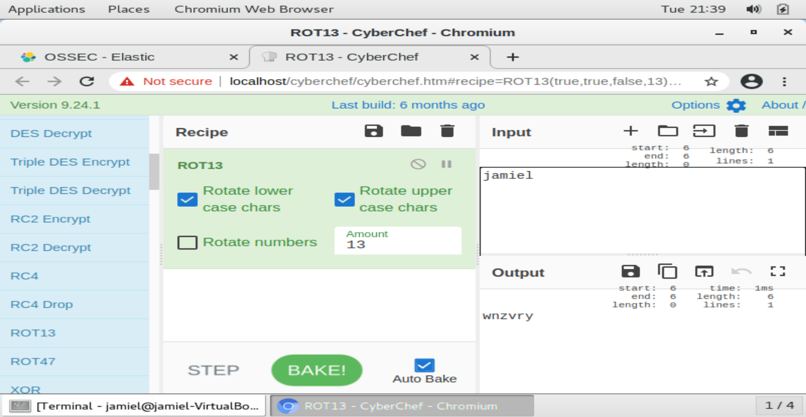
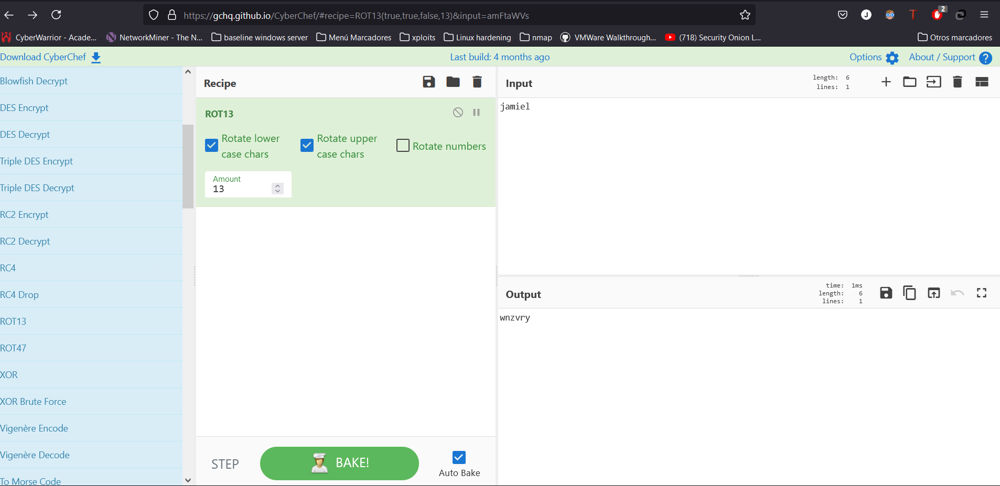
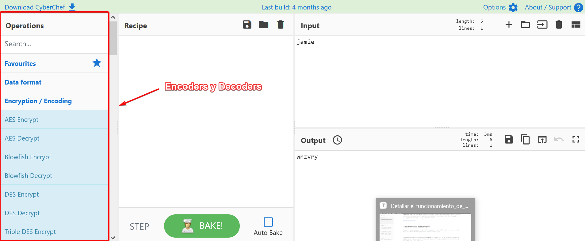
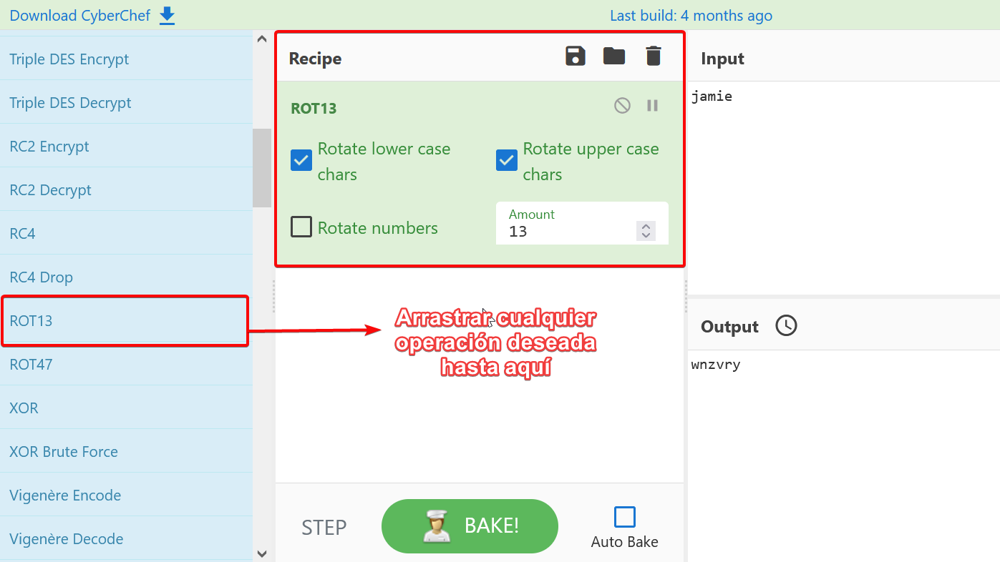
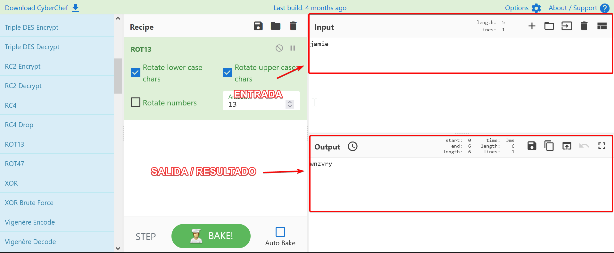

# **Detallar el funcionamiento de CyberChef**

## Qué es Cyberchef ? 

**Cyberchef** es una herramienta que nos permite descubrir secretos, decodificar  datos y, en general, buscar y encontrar información que está  aparentemente oculta al ojo humano. El mundo de la tecnología en  general, y de internet, en particular, está lleno de secretos.

[Fuente de la definición](https://protegermipc.net/2021/05/26/cyberchef-herramienta-para-descubrir-secretos-y-decodificar-datos/)

## **En general**

En mi opinión personal en una definición más llana simplemente es una plataforma que nos permite codificar y decodificar inputs en diferentes tipos de encriptación. 

Esta es una implementación que nos viene integrada en la instalación de **Security Onion**, que nos permite ejecutar esto de manera local.

Ahora cabe destacar que ya como está la tecnología hoy en día, ya tenemos un cyberchef totalmente online, sin tenerlo instalado en nuestro servidor. [Click aquí para ir al cyberchef online](https://gchq.github.io/CyberChef/)

**Nos ofrece lo mismo pero sin tener nada instalado :) **

## **Explorando la herramienta**

Lo primero que encontramos cuando accedemos a la web de cyberchef en la columna izquierda son los tipos de codificadores en los que podemos codificar nuestros inputs.

Luego justo al lado tenemos la sección de **Recipe** que en español viene siendo receta (como ya saben la página está orienta a una especie de chef o cocina) pero es refiriendose a la sección donde arrastaremos los codificadores que queremos usar.

Las siguientes dos opciones que veremos sin simples las del **INPUT Y OUTPUT**, una por donde introduciremos la string a codificar o decodificar y otra por donde saldrá el resultado según lo que queramos.

