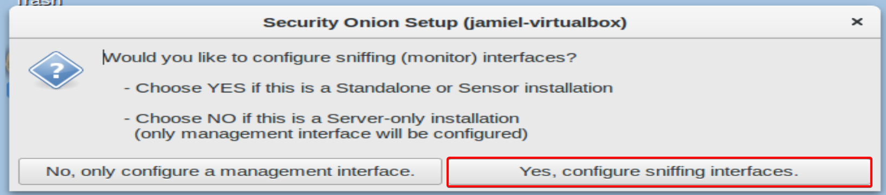

# **Instalar Security Onion como servidor standalone**

**ISO:** [Click aquí para descargar](https://download.securityonion.net/file/Security-Onion-16/securityonion-16.04.7.3.iso) 

En esta ocasion estaremos usando Virtualbox para ralizar este laboratorio ( para variar).

## **Configuración de la máquina virtual**

Para poder completar este lab de la manera más correcta posible necesitaremos los siguientes requerimientos.

- 30 GB.
- 8 RAM.
- 2 CORES.
- 2 adaptadores de red (En bridge).

Estos son los requerimientos que utilicé para preparar mi laboratorio.

## **Iniciando máquina**

Ya iniciada la máquina seleccionamos la primera opción de booteo.

Esperamos que suba la máquina, y nos quedará algo como esto.

Lo que sigue es hacer **doble click** en el apartado de Install **SecurityOnion 16.04**

Vamos a seguir con la siguiente paso dando click en **next** hasta llegar a la imagen que se muestra a continuación. Seleccionaremos la primera opción para formatear y comenzar la instalación de Security Onion.

Llenaremos los siguientes apartados Según el nombre que quieran poner, y la password.

En este paso procedemos a poner los datos del user para acceder a Security Onion.

Solo nos toca esperar a que termine el proceso mostrado en la imagen.

!!! note
    Posterior a este paso nuestra máquina será reiniciada.

Cuando termine toda la instalación nos mostrará una ventana como la siguiente. Daremos click en **Restart now.**

Ya iniciado sección nos logueamos con el user que indicamos anteriormente ahora nos aparecerá un ícono con el nombre de **setup** daremos click en el.

 

Lo primero que veremos son todos los servicios que se instalaran en este proceso, daremos click en **Yes, Continue!**

La siguiente ventana es para para la configuración de las interfaces, tenemos dos opciones configurarlas después y configurarlas ahora, en nuestro caso daremos click en **Yes, configure /etc/network/interfaces**

En el siguiente paso seleccionaremos la interfaz de management en nuestro caso será la primera.

!!! note
     Recordar que tengo dos interfaces las dos en bridge.
     
Ahora seguimos con la configuración de la IP, podemos fijarla tanto estatica, como obtenerla por DHCP, en mi caso escogí DHCP.

La siguiente ventana después de esto, es para configurar la interfaz de sniffing, como la queremos configurar ahora daremos click en **YES.**

Ahora la ventana que va después de esto simplemente nos muestra un review de lo que hemos hecho con las interfaces.

La ventana que sigue simplemente es de reboot daremos click en **YES.**

Ya reiniciado nuestro servidor, procedemos hacer click nuevamente en el ícono de **setup.**

Dado click en el ícono y saltando los pasos que ya hemos hecho, veremos una ventana que nos pondrán a seleccionar el modo en el cual queremos nuestro servidor, en nuestro caso **evaluation mode,** si leemos la información de arriba menciona que este modo es bueno para standalone Vms, y justo esto se adapta a los requerimientos que ha indicado el profesor.

En el siguiente paso seleccionaremos la interfaz de monitoreo, en este caso viene siendo la segunda.

Ahora vamos a designar un user y el password para loguearnos en las plataformas que se instalarán.

Pasado este paso nos encontraremos con una ventana de confirmación de los cambios que se harán daremos click en **YES.**

Ya terminado el setup veremos como ventana final lo siguiente.

## **Tópicos completados**

- [x] Instalar Security Onion como servidor standalone.
- [x] Configurar IDS.
- [x] Configurar Suricata.

- [x] Configurar Kibana para la visualización de los logs de Suricata.
