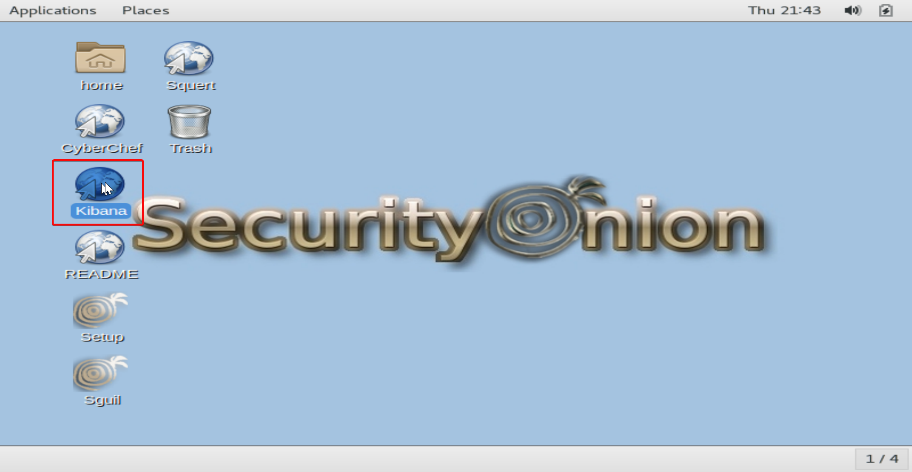
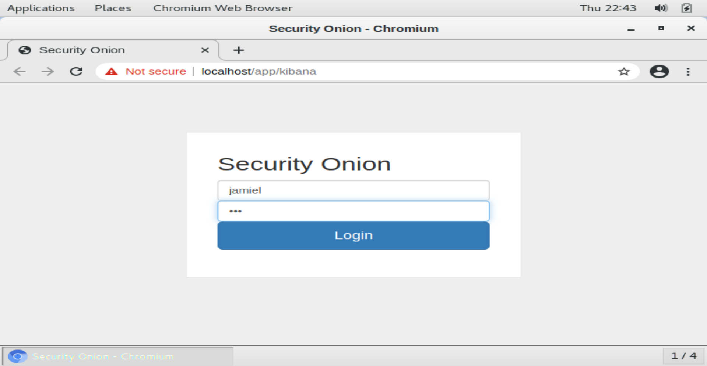
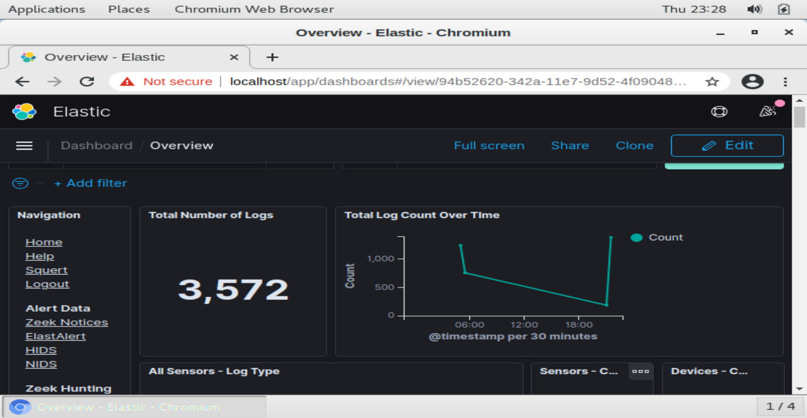
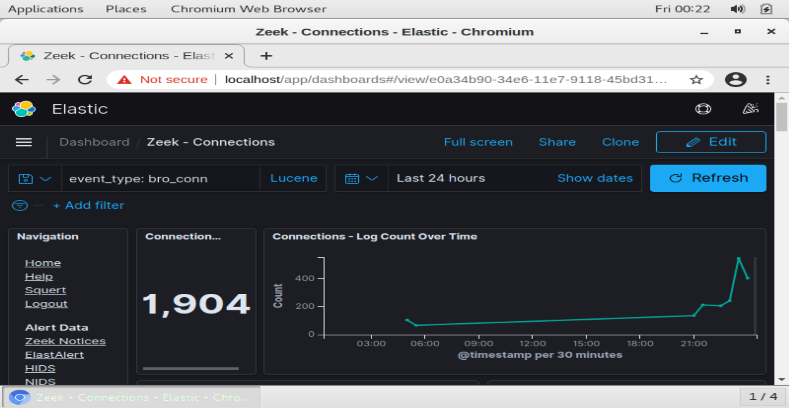
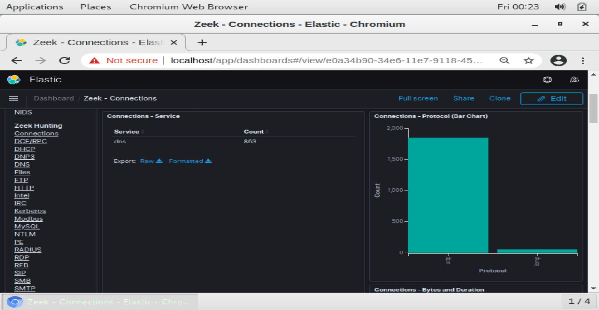

## **Accediendo a Kibana**

Veremos **Kibana** con un simple acceso directo al que podemos dar doble click.

Una vez abierta, nuestra web se nos abrirá el portal de login, el cual accederemos con las credenciales que hemos designado anteriormente para las plataformas.

Ya adentro lo primero que veremos es la sección general donde veremos cosas como (el número total de logs, los tipos de sensores que tenemos habilitados...).

Vamos a mostrar algo muy importante que tiene esta plataforma, dentro de la sección de **Zeek Hunting** existe un apartado llamado **connections**, donde podremos visualizar cosas como el numero total de conexiones que se han hecho en la red, los protocolos más se están utilizando, todas las IPS entrantes y un sin número de cosas más que nos ayudan al monitoreo.

!!! note
	Que conste que solo mostramos esto para dar un review de lo que se puede llegar a ver con esta plataforma, pero el gra1n número de módulos que podemos visualizar es increíble, desde detalladamente servicio por servicio, hasta outputs de herramientas tales como **sysmon**, **OSSEC**, **Beats**, entre otras. Definitivamente una de las tools más completa a nivel de monitoreo de red.
