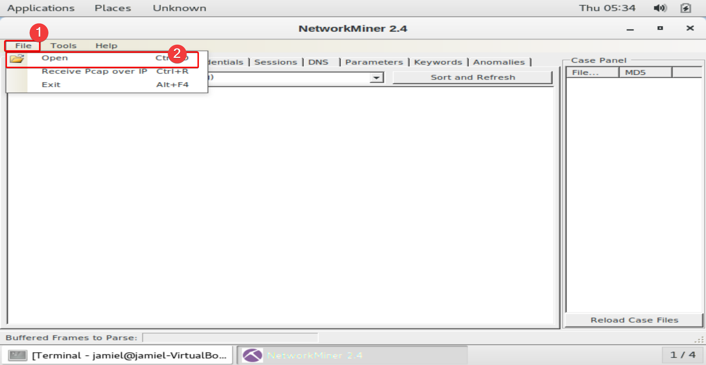
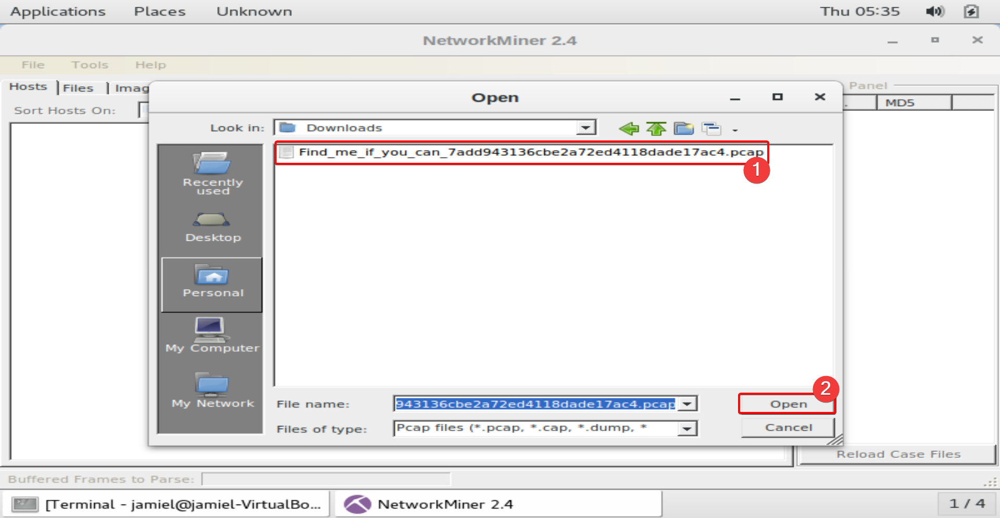
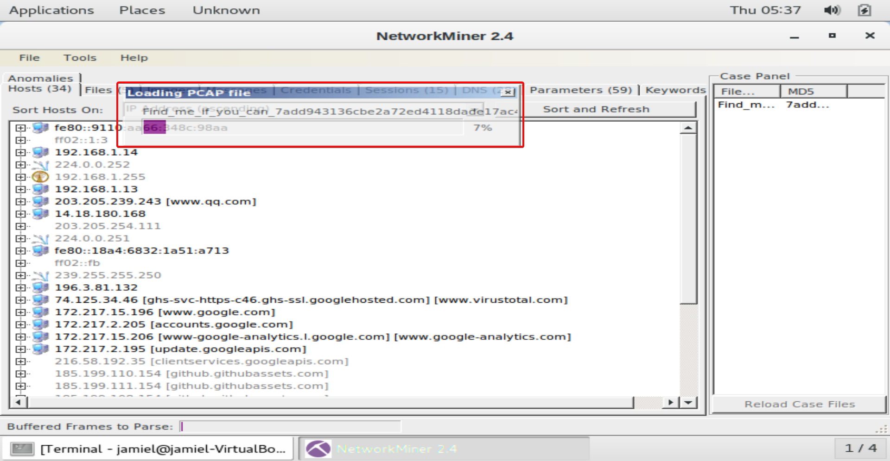
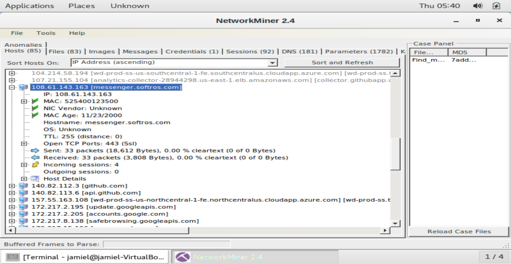
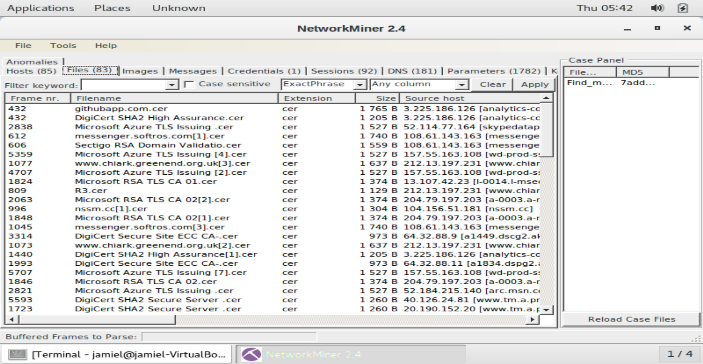
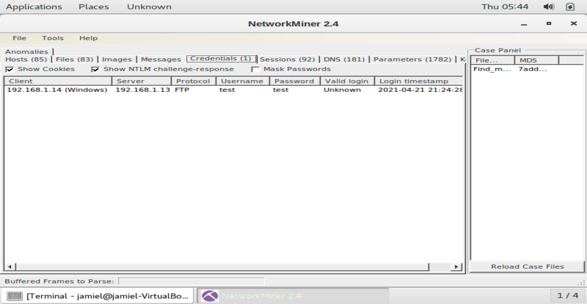

# **Network Miner**

-------------

## **Qué es Network Miner ?**

NetworkMiner es una herramienta de análisis forense de redes (NFAT) para Windows. NetworkMiner puede ser utilizado como una herramienta pasiva de sniffer/captura de paquetes para detectar sistemas operativos, sesiones, nombres de host, puertos abiertos, etc. sin poner ningún tráfico en la red. NetworkMiner también puede analizar los archivos PCAP para el análisis fuera de línea y para regenerar/reensamblar los archivos transmitidos y los certificados de los archivos PCAP. 

## **Analizando PCAPS con Network Miner**

Hemos obtenido una captura de red que nos ha dado como resultado un archivo **.PCAP** que contiene todo el tráfico que estaba pasando por la red, podemos hacer uso de herramientas como Network Miner que nos ayudan a parsear la información del .PCAP de una manera rápida y sencilla.

Lo primero que haremos es abrir nuestra tool Network Miner y pasarle el archivo .PCAP.

Esperamos que toda la info se parsee para poder verla de una manera ordenada, vamos a mostrar las partes más importantes de la tool.

1.**HOSTS** en esta sección veremos todos los host que se encontraron durante el momento de la captura, donde podemos ver información como su dirección IP, su dirección MAC. su HOSTNAME...

2.**Files** esta es otra parte importante de esta tool, vamos a poder encontrarnos con los archivos que se han transmitido por protocolos no seguros, que conste que estos archivos los podemos guardar en nuestra pc y revisarlos.

3.**Credential** La sección de credenciales mostrará todas las credenciales que se han transmitido por protocolos no seguros como un FTP o HTTP.

Existen otras secciones que también son muy importantes como la de mensajes o a la de imágenes pero estas solo están permitidas en la versión de pago. 

