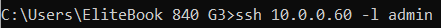
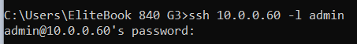
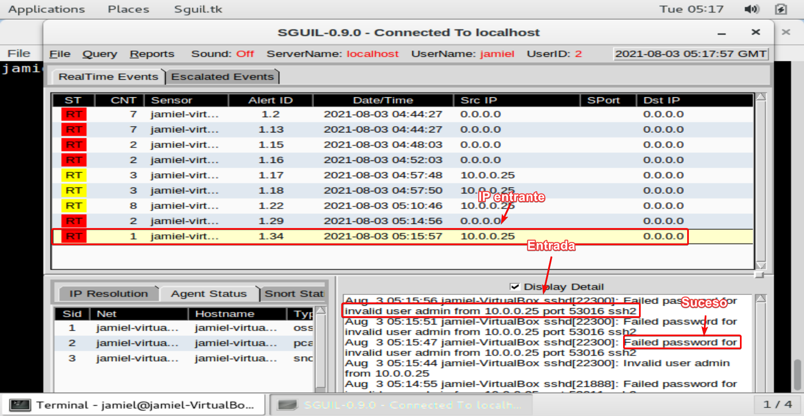
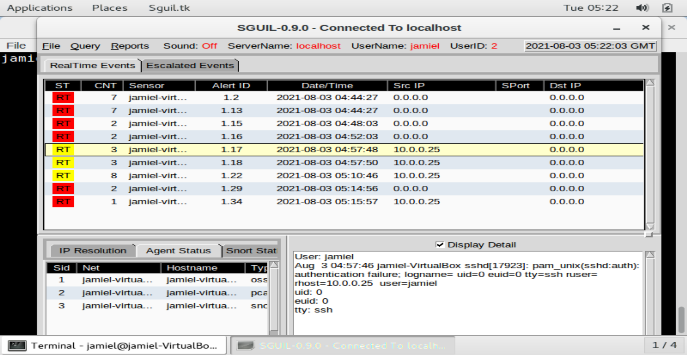

# **Sguil**

--------------------


[Squil web page](http://sguil.net:)

**Sguil** está construido por analistas de seguridad de redes para analistas de seguridad de redes. El componente principal de Sguil es una interfaz gráfica de usuario intuitiva que proporciona acceso a eventos en tiempo real, datos de sesión y capturas de paquetes en bruto. Sguil facilita la práctica de la supervisión de la seguridad de la red y el análisis basado en eventos.


## **Realizar demostración de Sguil.**

Para verificar el funcionamiento de Squil haremos un intento fallido por ssh, usaremos nuestra máquina local para realizar esto.

1. Abriremos nuestro CMD.
2. escribiremos:

```bash
ssh {ip de Security Onion} -l {user} # ejemplo ssh 10.0.0.60 -l jamiel
```



3. Damos click en enter y escribimos cualquier password incorrecta.

   

Hecho esto podemos ir a nuestro SQUIL y ver los resultados



En este caso intentamos con el user admin pero, de la misma forma registra el evento si somos otro user, por ejemplo jamiel.



!!! note
	Que conste que estos registros de eventos no solo se tratan de ssh, sino que registraran eventos de muchas de las conexiones entrantes siempre y cuando se haga algo que el software lo decte como extraño.

