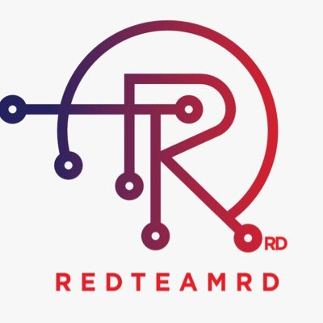

# **Wifi cracking CTF (RedteamRD)**

---------------------------------



El CTF consistió en los siguientes tres retos principales:

```bash
1. Cuáles son los dispositivos conectados al 1er Access Point (AP-Guess - está abierto).
2. Conseguir credenciales del File CakeGuest_028ddb17732e.
3. Conseguir credenciales del file Swagger_6cb0ce434217.
```

**PCAPS utilizados por si quieren replicar ustedes localmente.**

 [Cake pcap](CakeGuest_028ddb17732e.pcap)

[Swagger](Swagger_6cb0ce434217.pcap)

## **Overview**

En general me gustó mucho aprendí mucho sobre este mundillo de lo que se conoce hoy como redes inalámbricas, algunas terminologías que desconocía, y gracias al meet previo al CTF pude conocer e interesarme mucho más sobre este tema. En mi mente pensaba que las redes inalámbricas hoy en día estaban muy seguras, pero me di cuenta que no :)

## **Terminología**

**PMKID** es el identificador único de la clave utilizado por el AP para hacer un seguimiento de la PMK que se está utilizando para el cliente. PMKID es un derivado de AP MAC, Client MAC, PMK y PMK Name.

**BSSID** (Basic Service Set  Identifier), de una red de área local inalámbrica (WLAN), es un nombre  de identificación único de todos los paquetes de una red inalámbrica  para identificarlos como parte de esa red.

**SSID** es una secuencia de un máximo de 32 octetos incluida en todos los [paquetes](https://es.wikipedia.org/wiki/Paquete_de_red) de una [red inalámbrica](https://es.wikipedia.org/wiki/Red_inalámbrica) para identificarlos como parte de esa red. El código consiste en un máximo de 32 [caracteres](https://es.wikipedia.org/wiki/Carácter_(tipo_de_dato)), que la mayoría de las veces son [alfanuméricos](https://es.wikipedia.org/wiki/Alfanumérico) (aunque el estándar no lo especifica, así que puede consistir en  cualquier carácter). Todos los dispositivos inalámbricos que intentan  comunicarse entre sí deben compartir el mismo SSID.

**Beacon** es uno de los marcos de administración en **redes** inalámbricas **WLAN** basadas en IEEE 802.11. Los Beacon frames contienen toda la información sobre la **red** inalámbrica y son transmitidos periódicamente para anunciar la presencia de la **red WLAN**.

**Airodump-ng**  se utiliza para la captura de paquetes de tramas 802.11 sin procesar y es especialmente adecuado para recoger los IVs (vector de inicialización) de WEP con la intención de utilizarlos con aircrack-ng. Si tienes un receptor GPS conectado al ordenador, airodump-ng es capaz de registrar las coordenadas de los puntos de acceso encontrados. 

**Aircrack-ng** es una suite de software de seguridad inalámbrica. Consiste en un  analizador de paquetes de redes, recupera contraseñas WEP y WPA/WPA2-PSK y otro conjunto de herramientas de auditoría inalámbrica.

**Estos son solo uno de los pocos terminos que se escucharon en el meet de todas formas aquí les dejo el Meetup, por si tienen el placer de pasarse por allá, no hay desperdicio :)**

**Ahora si hora del hacking !!!!!!**


