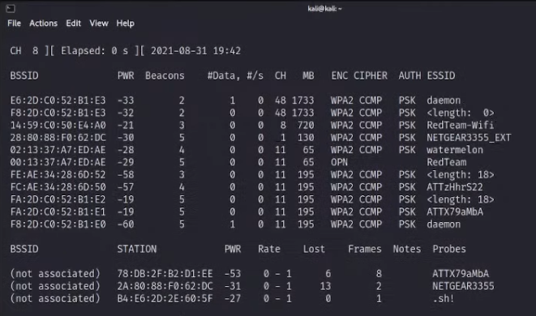

# **Cuáles son los dispositivos conectados al 1er Access Point (AP-Guess - está abierto)**
--------------------

Esto es relativamente fácil de realizar, primero haremos uso de la herramienta **airdump-ng** para detectar los APS que tenemos en la zona, lo realizaremos por medio de la wlan0 que es la interfaz que configuramos en modo monitor.

```bash
airodump-ng wlan0
```



Visto y detectado el objetivo de nosotros que es el **AP-GUESS**, podremos ver su **BSSID**, con el cual vamos a realizar el próximo ataque que nos dará lo que queremos. El BSSID de nuestro AP objetivo fue el siguiente, **02:ED:1F:44:EF:42**, ahora con el siguiente comando, vamos a detectar todos los dispositivos que se encuentran conectados a esa red, solo tenemos que ejecutar lo siguiente.

```bash
airodump-ng --bssid 02:ED:1F:44:EF:42 --channel 6 --write cap wlan0
```

Con este comando obtenemos el siguiente resultado:


Obteniendo las MACS de todos los dispositivos de esa red, el siguiente paso es identificar los dispositivos, en mi caso las marcas de estos, yo lo obtuve por medio de la siguiente página. [Mac Address an OUI Lookup](https://aruljohn.com/mac.pl)

!!! info
	74:9E:AF:0C:33:F2: **Apple, Inc.**

	50:7A:C5:0C:33:F2: **Apple, Inc**

	44:07:0B:0C:33:F2:  **Google, Inc**
 
	C4:93:D9:47:A2:80: **Samsung Electronics Co.,Ltd**
 
	7C:23:02:82:CE:EB: **Samsung Electronics Co.,Ltd**
 
	F8:95:EA:02:25:16: **Apple, Inc**


**Con esto ya hemos completado el reto número 1 :)**


