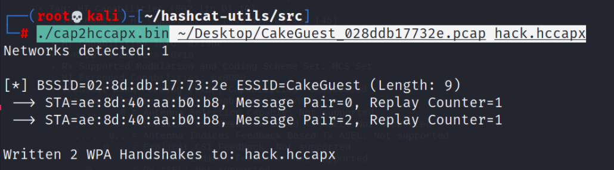

# **Conseguir credenciales del File CakeGuest_028ddb17732e**

-------------------------

Algo obligatorio en este CTF era hacer uso de **hashcat** para poder desifrar la password de del WIFI, por lo tanto si tenemos un poco de exp, sabemos que hashcat no trabaja con archivos PCAPS como los que nos proporcionaron, así que debemos buscar algún método para convertir este **PCAP**, en un formato complatible con hashcat. 

## **Cambiando formato**

Con un poco de búsqueda en internet encontramos una forma, y es que descargándonos el repositorio de **hashcat-utils**, podemos hacer uso de un **binario** que nos permite hacer la conversión que queremos. Nos clonamos el repositorio con el siguiente comando.

```bash
git clone https://github.com/hashcat/hashcat-utils
```

Descargado el repositorio, accederemos a un dir llamado **src**, estado ahí podremos observar un binario llamado **cap2hccapx**, es el que nos ayudará a cumplir nuestro cometido. Solo tendremos que insertar el siguiente comando estando en el dir donde se encuentra el **.bin**.

```bash
./cap2hccpax.bin [file.pcap] [convertido.hccapx]
```



Veremos que obtuvimos el archivo convertido e incluso nos dice que el file contiene **2 WPA Handshake**, muy bien !!!

!!! Question
	**Ahora nos viene la pregunta ¿Qué sigue?, crackear el file obtenido..., correcto !!!**

Insertando el siguiente comando haciendo uso de hashcat obtendremos nuestro resultado deseado.

```bash
hashcat -m 2500 [file.hccapx] /usr/share/wordlist/rockyou.txt
```

En el comando vemos que estamos haciendo uso del módulo 2500 de hashcat este módulo su nombre es **WPA-EAPOL-PBKDF2**, específicamente para crackear este tipo de protocolos de red, luego le pasamos el file que convertimos y por último le pasamos el wordlist que vamos a usar para crackear. Después de esperar un buen rato (esto va a depender de los recursos de tu PC), obtenemos el resultado.


**Lo logramos :)**


