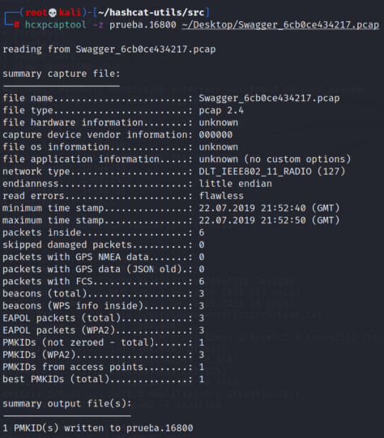
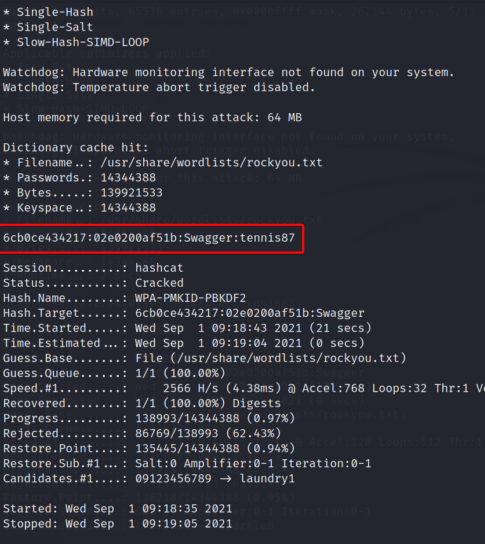

# **Conseguir credenciales del file Swagger_6cb0ce434217**

-------------

Vemos que si intentamos convertir el PCAP de este reto a formato **hccapx** observaremos que el file no contiene ningún handshake, ya desde ese punto vas notando que no se puede hacer el método anterior para conseguir la password. 

Por lo que vamos a intentar extraer el PMKID, para así de esta manera obtener la password, esto lo haremos haciendo uso de la tool llamada **hcxpcaptool**, esta nos permite extraer PMKID de PCAPS, y guardarlo en un file que debe de tener la extensión **.16800**. Por lo tanto el comando se vería de la siguiente manera.

```bash 
hcxpcaptool -z nombre_del_file.16800 {ruta del pcap}
```




Vemos que obtuvimos el **PMKID** de manera efectiva, ahora solo nos queda ponernos hack y obtener la password.

Ahora con hashcat en este caso utilizaremos el módulo 16800, que corresponde al módulo de PMKID, por lo tanto nuestro comando estaría contruido de la siguiente manera.

```bash
hashcat -m 16800  [file.16800] [wordlist]
```



Lo hemos hecho nuevamente, somos unos cracks !!!!


